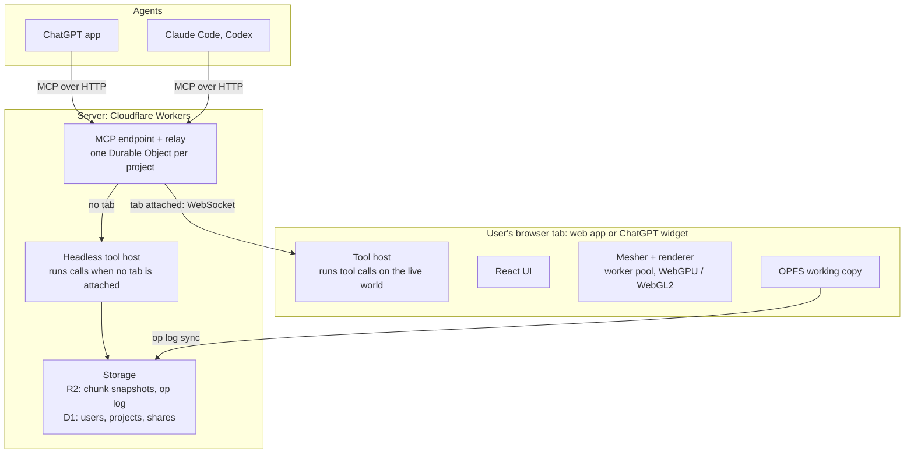

# Voxyl Web — Migration Plan

Status: **Plan accepted** (2026-10-03). **Phase 0 in progress**: chunked World with storage
by content, greedy mesher in a worker pool, packed-quad GPU format, city fixtures, the in-app
benchmark, and Minecraft-style lighting with two renderers, baked into quads or read from a
light volume (see [`web-lighting.md`](web-lighting.md)), are built. Numbers are under
"Phase 0 findings" and in the lighting plan; what is left and what comes next is under
"Phase 0 status". Default chunk size is 64³; draw batching is deferred.
Reviewed as a Claude Doc
(https://claude.ai/code/artifact/98f31d14-989b-4c28-a24c-a3d7b8630a21); this file is now the
working copy. **Keep it (and `web-lighting.md`) up to date as we go**, in the same commit as
the work: what is done, what is proven with numbers, the user's decisions, and next steps, so
work can resume from the plans alone.

Voxyl moves to a TypeScript web app in seven gated phases (0 to 6). The Godot app stays the
daily driver until the web editor and agent tools both pass their gates, and every phase must
prove performance before the next begins. All web code lives in the top-level `web/` folder.

## Goals and non-goals

**Goals**

1. **The client does the work.** Meshing, lighting, rendering and tool execution run on the
   user's machine. When an agent drives a build over MCP, its tool calls execute in the user's
   open tab whenever one is attached. The server handles persistence, auth, relay and a
   headless fallback.
2. **Agents see cheaply.** Screenshots come in tiers. The cheapest legible tier is the default,
   and a full textured render is available on request. The tools steer agents toward the
   minimum they need.
3. **Large builds stay fluid.** Target 5M occupied cells, about 40x Conduit Factory (about 122k
   cells today), with no usability cliff.
4. **Maintainable and verifiable.** Strict TypeScript throughout. The core is pure and
   headless, so almost everything is testable without a browser. Every phase ships with its
   tests and benchmarks.
5. **Modern browsers only.** WebGPU first, with the WebGL2 fallback that Three.js provides for
   free. Also OPFS, module workers and OffscreenCanvas. No further legacy support.
6. **Staged, never big-bang.** Each phase is usable on its own and ends at a go/no-go gate.
7. **The CLAUDE.md principles carry over unchanged.** Cells store intent, views are lenses on
   one world, palettes stay swappable, nothing is Minecraft-specific in the core, and undecided
   is a valid state.

**Non-goals for now**

- Real-time multi-user co-editing. Each project has one writer at a time.
- Editing on phones. Viewing on mobile is fine.
- Hosting Minecraft or mod textures (see Risks).
- Day-one parity. Some Godot-only pieces (the Movie Maker video pipeline, the dev restart
  plugin) may never port.
- Copying the Godot UI layout. The web editor gets a UX designed for the web.

## Feature inventory

The Godot app is about 35k lines of GDScript in `scripts/`, plus 6.5k lines of tests and about
70 MCP tools. Line counts are rough, for scope rather than estimates. The renderer and the
Minecraft importers are the two biggest pieces, and the renderer is the one that has to change
design, not just language.

| Area | What it covers today | Key files | GDScript lines | Port phase |
| --- | --- | --- | --- | --- |
| Core data and edits | Sparse cells (semantic, orientation, tags, parts), world, workspace, undo history, region ops, transforms, orientation, selection | `VoxelWorld`, `VoxelData`, `RegionOps`, `EditHistory`, `SpatialXform` | 4,700 | 1 |
| Palettes and block model | Palette stack, entries, block types, models, blockstate maps, texture assets | `Palette`, `BlockLibrary`, `BlockModel`, `BlockStateMap`, `LibraryStore` | 1,300 | 1 (data), 2 (textures) |
| Shaped parts and attachments | FMP microblock slots, ArchitectureCraft shapes, placement rules, torches | `ShapeCatalog`, `ShapeRules`, `ArchShapes`, `Attachment` | 2,250 | 1 (rules), 2 (meshes) |
| Projects and prefabs | Save/load, project settings (north, grid offset), prefab store and thumbnails | `ProjectStore`, `PrefabStore`, `Prefab` | 350 | 1 (local), 4 (server) |
| 3D view | Fly/orbit camera, picking, placement, ghosts, paste, wand, slice, cutaway, sky, compass, per-cell node rendering | `View3D`, `BlockMesher`, `CameraFraming` | 5,500 | 2 (render), 3 (interaction) |
| 2D grid view | Layer-by-layer editing | `View2DGrid` | 850 | 2 (read), 3 (edit) |
| App UI | Home screen, multi-view shell, inventory, block chooser, hotbar, palette panel, prefab browser, legends, dialogs | `HomeScreen`, `MultiViewShell`, `InventoryScreen`, `Hotbar` | 8,500 | 3, redesigned rather than copied |
| MCP server and tools | HTTP server with bearer auth, about 70 tools, capture service, agent setup | `McpServer`, `tools/*`, `CaptureService` | 4,300 | 4 |
| Schematic export | NBT write, Schematica writer, material list, FMP and AC part export, MC ids | `SchematicaExporter`, `NbtWriter`, `FmpParts`, `AcParts` | 1,100 | 4 (export), 5 (import and probe) |
| Minecraft asset import | Jar/zip/dir sources, models and textures, pane healing, GTNH, Chisel, NEI roster, microblocks cfg | `MCImporter`, `GTNHExtension`, `ChiselVariations`, `NeiRosterImporter` | 5,600 | 5 |
| Lighting | Approximate MC block light (on branch `lighting`) | `BlockLightRig` | small | 3 (basic), later (MC-style) |
| Tests | Smoke, MCP, shell, schematic suites | `tests/*` | 6,500 | Ported alongside each phase |

Not ported: the quickstart video pipeline (Movie Maker, director, Kokoro), the `voxyl_dev`
restart plugin, and the old `-s` design driver.

## Target architecture

One TypeScript core runs in two hosts. The user's browser tab does the work whenever it's open,
and a headless server host fills in when it isn't. Every tool call enters at the relay. It runs
in the tab when one is attached, and on the headless host otherwise.

Shared TypeScript packages (`core`, `tools`, `formats`, `raster`) are the same code in both tool
hosts.

**Packages** (a pnpm monorepo under `web/`)

| Package | Contents | Runs in |
| --- | --- | --- |
| `core` | World, chunks, cell-state table, palettes, shape rules, attachments, selection, region ops, undo, prefabs | Everywhere: no DOM or Node APIs |
| `formats` | Interchange format, NBT, Schematica, Godot project import | Everywhere |
| `tools` | MCP tool definitions: Zod schemas plus handlers over `core` | Both tool hosts |
| `raster` | CPU capture renderer for tiers 1 and 2 | Worker, server |
| `mesher` | Chunk meshing, part and model geometry cache | Worker pool |
| `render` | Three.js scene, palette lookup texture, picking, overlays | Browser |
| `web` (app) | React app built with Vite | Browser |
| `server` (app) | MCP endpoint, relay, headless host, storage API | Cloudflare Workers, with a plain Node host as fallback |
| `mc-import` | Jar, zip and folder reading, model and texture import, GTNH and Chisel extensions | Browser worker only |

**Stack.** TypeScript (strict), Vite, React for UI chrome only (the world is never rendered
through React), Zustand for UI state, Three.js `WebGPURenderer`, Comlink for workers, Zod,
Vitest, Playwright and pnpm workspaces.

**State and sync**

- **One writer per project**, held as a lease by the relay. While a tab holds the lease, its
  world is authoritative, and both user edits and agent tool calls apply there.
- **Every mutation is an op**, the same unit as today's undo step. The tab writes ops to OPFS at
  once and streams them to the server, which appends them to the op log and compacts the log
  into chunk snapshots.
- **With no tab**, the headless host takes the lease, loads only the touched chunks, applies the
  op and logs it. A tab opened later replays the ops since its last snapshot.
- **Undo history keeps source labels** such as "Claude: region_fill", as it does today.

**Formats.** Chunks are stored as palette-indexed `Uint16` runs, compressed with the browser's
built-in `CompressionStream`, so there are no codec dependencies. Library block types and models
are JSON. Textures go into GPU texture arrays.

**Lighting.** Phase 0 already built Minecraft-style light (sky plus colored block light,
flood-filled, incremental on edits) and Minecraft's lightmap, as a setting that can be
switched off. Light is derived from cells and the palette and never saved, so the format
carries no light. The lit renderer is likely to be a light volume read in the shader rather
than light baked into quads; [`web-lighting.md`](web-lighting.md) has the comparison.

**Accounts.** There is no native sign-up. A user starts as an anonymous record, keyed by a
device token, the first time they save to the server. Signing in links a Google or Apple
identity, and later Sign in with ChatGPT, to that same record, so nothing is copied or
migrated. If the identity already belongs to another user, the two users' projects merge into
one account.

## Agent screenshots

Captures default to a flat-shaded semantic render at 512 px. Anything richer is opt-in, and
every response reports what the capture cost. Only the top tier needs a GPU, so tiers 0 to 2
work even with no browser tab attached.

| Tier | What it shows | Default size | Renders where | Typical use |
| --- | --- | --- | --- | --- |
| 0: text | Layer slices and stats as text (today's `region_text`, `region_stats`) | n/a | Anywhere | Checking counts, alignment and holes without an image |
| 1: massing (default) | Flat colour per semantic, directional shading, simple AO, edge lines, no textures | 512 px | CPU rasterizer, client or server | Shape and proportion checks while iterating |
| 2: material | Each block's average texture colour, shaped parts as real geometry | 512 to 768 px | CPU rasterizer, client or server | Judging palette contrast and depth |
| 3: full | Textured, lit, sky, real camera | Up to 1280 px | Client GPU only | Final review, comparison against a reference image |

**How the tools nudge agents toward less**

- `screenshot` defaults to tier 1 and 512 px. Tier and size are explicit arguments, and the tool
  description says what each costs.
- Captures auto-frame to the last edit's bounds unless a camera is given, so the agent doesn't
  pay for empty sky.
- `capture_sheet` packs several angles into one image, so one call replaces four.
- A `changed_since` mode tints the cells edited since the last capture, so the agent can verify
  an edit without rereading the whole scene.
- Each response carries a soft per-session image budget (`images_used`, `budget_remaining`).
  Past the budget the server downgrades to tier 1 and says so, rather than refusing.
- Images are WebP or JPEG, never PNG, unless the agent asks for lossless.

The CPU rasterizer is a small orthographic and perspective voxel renderer in TypeScript, run in
a worker. It is deterministic, which also makes it the golden-image backbone of the test suite.

## Performance targets

The bar is a 5M-cell world at 60 fps on integrated graphics, with edits that show up within a
frame or two. The reference machine is a mid-range laptop with an Apple M1 or Intel Iris Xe
class GPU, at 1080p in Chrome. Conduit Factory (about 122k cells, 4.2 MB on disk) is the
realistic fixture. A seeded synthetic city generator provides the 1M, 5M and 20M fixtures.

| Metric | Target at 5M cells | Stretch (20M) | Measured by |
| --- | --- | --- | --- |
| Fly-through frame time | 16.7 ms p95 | 16.7 ms p95 | Scripted camera path, browser frame timing |
| Open project to first interactive frame | 3 s (progressive, near chunks first) | 8 s | Bench harness, cold OPFS cache |
| Single-cell place to visible | Next frame | Next frame | Input-to-present trace |
| 100k-cell fill or replace to visible | 250 ms | 500 ms | Core bench plus remesh timing |
| Undo of that fill | 250 ms | 500 ms | Core bench |
| Tab memory | 1.5 GB | 3 GB | `performance.measureUserAgentSpecificMemory` |
| Autosave | Dirty chunks only, never blocks input | Same | Main-thread long-task count |
| Tier 1 capture of a 1M-cell region | 300 ms | n/a | Rasterizer bench |

**What makes these reachable**

- **Chunked dense storage.** 32x32x32 chunks of `Uint16` cell-state ids. Each id points into an
  interned table of unique (semantic, orientation, tags, parts) combinations, so shaped cells
  stay compact too.
- **Meshing in a worker pool.** Greedy meshing for full cubes, cached per-model geometry for
  shaped parts and custom models. Only dirty chunks are rebuilt, and each chunk becomes one
  draw.
- **Material swaps never remesh.** Meshes carry semantic ids, and the palette is a lookup
  texture the shader reads, mapping (semantic, face) to a texture layer. A swap that changes a
  semantic's shape or model remeshes only the chunks that use it. This is principle 3 enforced
  by the renderer.
- **Distance LOD and frustum culling per chunk**, so open time and frame time track what's
  visible rather than world size.
- **Benchmarks run in CI on every PR**, at least for the CPU paths, with a regression budget of
  10%. GPU numbers are tracked on the reference machine at each phase gate.

## Phased plan

The riskiest bets are tested first, in a two-to-three-week spike, before any feature is ported.
Each later phase leaves something usable, and nothing moves on until its gate passes. A missed
gate means fixing or rethinking that phase, not starting the next one.

| Phase | Scope in brief | Gate to pass before moving on |
| --- | --- | --- |
| 0 · Spike: prove the bets | Chunked core, worker mesher, renderer, relay test | 5M cells at 60 fps p95 on the reference laptop; widget relay works, or fallback chosen |
| 1 · Core parity | Headless world, ops, undo, prefabs, Godot exporter | Parity suite green on every saved project; schematic export byte-identical to Godot |
| 2 · Web viewer | Textured 3D, palette swaps, 2D grid, OPFS storage | Perf targets met with textures on; golden images match Godot captures |
| 3 · Editor | New web UX, placement, selection, paste, lighting | A real hand-build session done on the web; perf targets hold while editing |
| 4 · Agents on the web | Relay, headless host, ~70 tools, capture tiers, export | Agent eval builds as well as in Godot; Godot retired; private ChatGPT test |
| 5 · Minecraft import | Jar and modpack import in browser, schematic import | Full GTNH library imports in the browser; output matches the Godot import |
| 6 · Public launch | Accounts, sync, sharing, quotas, ChatGPT app listing | ChatGPT app approved and listed; hosting cost tracked per active user |

**Scope by phase**

0. **Spike.** A minimal chunked core, a greedy mesher in a worker pool, and a Three.js renderer
   with the palette lookup texture. Add a Godot exporter for Conduit Factory, seeded synthetic
   1M, 5M and 20M-cell fixtures, a dense shaped-parts fixture, and a tier 1 CPU rasterizer
   prototype. Test whether a ChatGPT widget can hold a WebSocket to our relay.
1. **Core parity.** The full headless `core`: cells, parts, attachments, palette stack, shape
   rules, orientation and transforms, region ops, selection set ops, `structure_find`, undo,
   prefabs, project settings (north, grid offset) and the interchange format. Port the Godot
   exporter for every project and the library. Port `SmokeTest`.
2. **Web viewer.** Open any exported project read-only, with textured 3D, palette swaps, shaped
   parts and models, panes, sky, a read-only 2D grid, a basic multi-view shell and OPFS storage.
3. **Editor.** A UX designed fresh for the web rather than a copy of the Godot layout. It covers
   fly and orbit camera with left-hand bindings, place and remove, part placement ghosts,
   selection tools, paste and prefab placement with rotate and mirror, wand, slice, cutaway, 2D
   grid editing, palettes, block picking, hotbar, prefabs, a project home and settings, and
   basic lighting. It runs entirely in the browser, with no server yet.
4. **Agents on the web.** The server (relay, headless host, storage) with anonymous projects,
   all MCP tools ported in priority order (edit, selection, palette and capture first), capture
   tiers 0 to 3, and schematic export. Connect Claude Code and Codex, and run a private ChatGPT
   app.
5. **Minecraft import.** Jar, zip and folder import in a browser worker into OPFS, with GTNH,
   Chisel variations, pane healing, NEI roster, microblocks config, and schematic import and
   probe.
6. **Public launch.** Account linking (Google and Apple first, Sign in with ChatGPT second),
   upgrading anonymous users in place. Also cross-device sync, share links, quotas and rate
   limits, the hosted default texture set, ChatGPT app submission and the donation link.

**While the port runs.** Godot gets fixes and keeps being used for builds, but no large new
features from Phase 1 until the Phase 4 gate. Otherwise the parity target keeps moving.

### Phase 0 findings

First run 2026-10-03, headless Edge on an Intel Arc B580, 1600x900, 8 mesh workers. Headless
frame pacing is rougher than a real browser window, so treat frame p95 as pessimistic.

| World | Chunk | Draws | Initial mesh | Frame p50 / p95 | Main thread p50 | Edit to visible p50 | 1M fill visible |
| --- | --- | --- | --- | --- | --- | --- | --- |
| 5M city | 16³ | 7.9k | 2.7 s | 33 / 183 ms | 17 ms | 173 ms | 235 ms |
| 5M city | 32³ | 1.3k | 0.46 s | 16.7 / 33 ms | 8.8 ms | 31 ms | 73 ms |
| 5M city | 64³ | 300 | 0.32 s | 16.7 / 16.9 ms | 2.5 ms | 16.6 ms | 36 ms |
| 20M city | 32³ | 5.4k | 1.95 s | 33 / 117 ms | 14.8 ms | 117 ms | 153 ms |
| 20M city | 64³ | 1.3k | 1.37 s | 16.7 / 33 ms | 7.9 ms | 27 ms | 63 ms |

- **Draw calls are the bottleneck, not meshing.** Main-thread time is about 6 to 7 µs per chunk
  mesh drawn, whatever the cell count. Remeshing is cheap: a 32³ chunk takes about 0.5 ms in a
  worker, a 64³ chunk about 4 ms, and edits stay at one or two frames once the frame itself
  is fast.
- **Packed quads are tiny.** 5M cells make 0.68M quads, 5 MB on the GPU at 8 bytes a quad.
  Dense chunk storage (89 MB at 5M cells, 32³) is the bigger memory cost; palette-compressed
  or uniform chunks can cut it later.
- **Real Chrome agrees** (user's run, 3840x1906, 60 Hz display, B580): at 64³ the flight holds
  16.7 ms p50 and p95 with 2.6 ms main thread, single edits land in one frame (16.6 ms p50),
  and a 1M-cell fill is visible in 35 ms. 32³ drops frames (9.7 ms main thread, p95 33 ms).
  16³ is unusable (81 ms main thread; some frames stalled for seconds while three set up
  thousands of meshes).
- **128³ is past the sweet spot** (headless, 5M city): draws fall to 90 and main thread to
  1.1 ms, but frame rate was already capped at 60, while edits slow to 50 ms (3 frames) and
  fills to 84 ms. Meshing scans the whole chunk volume, empty air included, so a 128³ chunk
  takes about 38 ms to remesh, and dense storage grows to 364 MB at 5M cells and 1.6 GB at 20M.
  128 is also the largest size the byte-packed quad format can address.
- **Two knobs, not one.** Chunk size trades edit cost and memory against draw count only
  because each chunk is its own draw. The app now defaults to 64³, the best single setting.
- **Render batches are deferred.** At 64³ the draw count is fine. If it isn't on weaker
  hardware, keep mesh chunks at 64³ and draw groups of chunks (a 128- or 256-cell region) from
  one buffer, so draw count tracks regions, not chunks.
- **Storage follows content** (done): bricks that are empty, uniform or palette-packed cut
  chunk storage from 162 MB to 34 MB at 5M cells.
- **Minecraft-style lighting works** and is a setting. Light read from a light volume in the
  shader won over light baked into quads (7.4x fewer quads, one-frame edits, and the shader
  is free at 4K on the B580). Details, numbers and its next steps are in
  [`web-lighting.md`](web-lighting.md).

### Phase 0 status (2026-10-04)

Done and proven, all on the B580 (headless Edge plus the user's Chrome at 3840x1906):

- [x] Chunked core with storage by content, raycast, cell-state interning (`packages/core`).
- [x] Greedy mesher in a worker pool, 8-byte packed quads, palette lookup texture.
- [x] Seeded city fixtures (1M, 5M, 20M cells) and the in-app benchmark (`Run benchmark`).
- [x] 5M cells at 60 fps, p95 16.8 ms, with lighting on or off; one-frame edits.
- [x] Minecraft-style light engine, Minecraft's lightmap, and the light volume renderer.
- [x] `pnpm shot` to check the running dev server headless.
- [x] World, light engine and mesh scheduling in a world worker (`packages/session`,
  `apps/web/src/world/`): generating and lighting never block drawing (2026-10-04).
- [x] Sparse light: CPU light in 8³ bricks (54 MB at 5M cells, was 249 MB) and a sparse 4³
  brick light volume on the GPU (60 MB, was 178 MB; about 0.3-0.6 ms of GPU per frame). Baked
  light removed (2026-10-04). A TSL bug that misread light at brick boundaries fixed
  (2026-10-05, see the lighting plan's "Shader bug").
- [x] GPU time per frame from timestamp queries, in the HUD and the benchmark.

Still open for the Phase 0 gate:

- [ ] Run the benchmark on the MacBook M4 (the reference laptop for the gate).
- [ ] ChatGPT widget WebSocket test: can a widget hold a socket to our relay?
- [ ] Tier 1 CPU rasterizer prototype (agent screenshots).
- [ ] Godot exporter for Conduit Factory, and a dense shaped-parts fixture.

**Next steps, in order** (the user agreed on the worker and sparse light on 2026-10-04):

1. ~~World and light engine in a worker~~ (done).
2. ~~Sparse light~~ (done; the user chose the sparse light volume over per-face light, for
   shaped parts and future volumetric effects).
3. **Light engine speed**: faster flood fill and volume relights for big fills (1M-cell fills
   take 2.6-3.4 s); see [`web-lighting.md`](web-lighting.md), "Next steps".
4. The open Phase 0 items above, M4 run first.

## Testing and verification

The Godot app is the oracle. The web core has to match it on the same inputs before anything is
built on top. Most tests run headless in Node in seconds, and only rendering and interaction
need a browser.

| Layer | Tool | What it proves | Runs |
| --- | --- | --- | --- |
| Unit and property | Vitest, fast-check | Region ops, transforms, rotation round-trips, undo restoring exact state, shape slot rules | Every commit |
| Godot parity | Vitest plus fixtures exported from Godot | Same op script gives the same cells, `region_stats` and Schematica bytes in both apps | Every commit |
| MCP contract | Vitest against the tool registry | Each tool's schema, arguments and error codes match the ported `McpTest` cases | Every commit |
| Golden images | Vitest (CPU rasterizer); Playwright with SwiftShader (GPU renderer) | Renders match committed images within a pixel tolerance | Every PR |
| Performance | Vitest bench (CPU); scripted Playwright runs on the reference machine (GPU) | Targets above, regression budget 10% | CPU every PR, GPU at each gate |
| End to end | Playwright | Open, edit, undo, save, reload, export through the real UI | Every PR |
| Agent eval | A fixed set of build prompts and reference images, run through the real MCP surface | Agents still build well after tool changes, scored against reference renders | At each gate |

**Parity harness.** A small Godot exporter writes projects, palettes and the library to the new
interchange format, and records op scripts (the same tool calls replayed in both apps).
Byte-equal schematic export is the strictest check and the cheapest to automate.

**Type safety.** `strict` TypeScript with `noUncheckedIndexedAccess`. Tool argument schemas are
written once with Zod, which generates both the MCP JSON schema and the runtime validation.

## Risks and open questions

The two risks that could change the plan are texture licensing and whether a ChatGPT widget can
host tool execution. Both are checked in Phase 0, before any port work.

| Risk | Why it matters | Mitigation |
| --- | --- | --- |
| Minecraft and mod textures can't be hosted | The current 85 MB library is imported from Mojang and mod jars. A public site can't serve it. | Imports run in the browser from the user's own jar or modpack and stay in their OPFS, never uploaded. Hosted users get an original or openly licensed default set and tier 1 and 2 colours. Block ids still map for schematic export. |
| ChatGPT widget sandbox | Client-side tool execution needs the widget iframe to hold a live connection to our relay. The Apps SDK's network rules may not allow it. | Prove it in Phase 0. If it fails, ChatGPT sessions run on the headless server host, which works but costs server CPU. |
| Port drift | Godot keeps gaining features while the port chases it, so the target keeps moving. | Freeze large Godot features from Phase 1 until the Phase 4 gate. Fixes and builds continue. |
| Renderer misses targets | The whole case for the move rests on big builds staying smooth. | Phase 0 measures the renderer on 5M cells before anything else is ported. If it misses, the fallback is a Rust or WASM mesher behind the same worker interface. |
| Shaped-part and model meshing cost | Parts and custom models can't be greedy-merged, and dense microblock builds may blow the triangle budget. | Include a dense parts fixture in the Phase 0 bench, and cache per-chunk part geometry. |
| Agent quality differs by host model | ChatGPT's model may use the tools less well than Claude does. | The agent eval set runs against several models at each gate. Tool descriptions are tuned for the weakest one that matters. |
| Serverless memory limits | A Worker has about 128 MB, which won't hold a large world. | The headless host loads only the chunks a tool call touches. A plain Node host stays a drop-in escape hatch. |

**Open questions**

- [ ] Does the ChatGPT Apps sandbox allow a persistent WebSocket from the widget to our domain?
  (Phase 0)
- [ ] Which openly licensed texture set, or an original one, becomes the hosted default?
- [ ] Should Codex and Claude Code connect to the hosted relay, a local relay, or both?
- [x] Lighting at launch: basic lighting ships in Phase 3, architected for Minecraft-style
  light. (Phase 0 then built Minecraft-style light as a setting; light is derived and never
  saved, so the format needs no light channels.)
- [x] Accounts: anonymous projects come first. Linking-only accounts (Google, Apple, then Sign in
  with ChatGPT) upgrade them in place.
