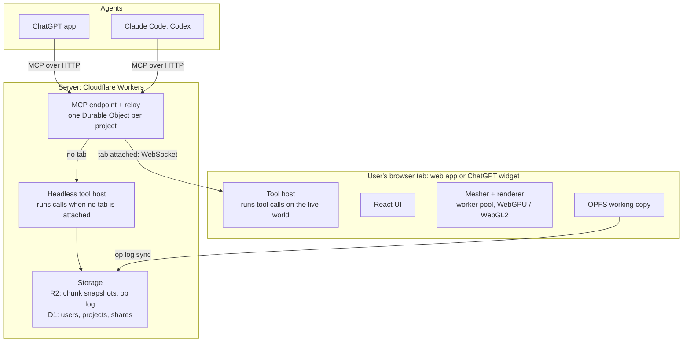

# Voxyl Web — Migration Plan

Status: **Plan accepted** (2026-10-03). **Phase 0 done** (2026-10-06): chunked World with
storage by content, a greedy mesher in a worker pool, Minecraft-style lighting read from a
sparse light volume (see [`web-lighting.md`](web-lighting.md)), shaped parts, and a ChatGPT
widget that runs relayed tool calls. 5M cells hold 120 fps on an M5 Max. Numbers are under
"Phase 0 findings" and "Phase 0 status". **Phase 1 built** (2026-10-06, all seven steps): the
core redesigned from scratch, per the design document [`web-core.md`](web-core.md), which
records what was built and the numbers; the user confirmed step 7's four choices.
**Phase 2 done** (2026-10-07): the web viewer, planned and tracked in
[`web-viewer.md`](web-viewer.md): projects, storage, 2D view, part trimming, block libraries
with textures and a vanilla jar import, block models, the sky, and the gate (golden images on
SwiftShader, performance with textures on; the 100k fill misses on the B580 desktop only, held
up by the deferred light engine). **Phase 3 started** (2026-10-07): the editor, planned and
tracked in [`web-editor.md`](web-editor.md). Steps 1 to 3 are in: the edit loop, the
palette drawer, and selection (box, wand, region commands, orbit). A feedback pass before
step 4 added multi-pane layouts with per-view time of day, an inventory for loading the
hotbar, and selection actions kept apart from the selection panel. A second pass gave each
pane a toolbar built from shared pieces, 3D camera cones and compasses, the 2D slice drawn in
3D, a Keys panel, and the tools inside the inventory; `web-editor.md` also lists the gaps from
the Godot app and a proposal for cross-project palettes. A third round, on the user's
answers, built them: a keymap, Godot's wand plus Build to me and Exchange, camera presets and
orbit, render modes with feature edges, slicing from 3D, Home with shared palettes and a
textured starter palette, the block chooser, and 2D editing (editor step 6). A fourth
round baked block icons, opened the palette entry editor from the inventory, and recorded
the production deploy for voxyl.xyz (see "Production (voxyl.xyz)"). A fifth round passed, and
the rest of the editor landed on the user's word: shape selection, placing shaped parts (with a
ghost), a top-level semantic editor, copy, cut and paste with prefabs, cutaway and isolation,
project settings, rebindable keys, and 2D part footprints. What remains of Phase 3 is the
gate's hand-build session (editor-measured performance holds: 60 fps, one-frame edits).
Reviewed as a Claude Doc
(https://claude.ai/code/artifact/98f31d14-989b-4c28-a24c-a3d7b8630a21); this file is now the
working copy. **Keep it (and `web-lighting.md`) up to date as we go**, in the same commit as
the work: what is done, what is proven with numbers, the user's decisions, and next steps, so
work can resume from the plans alone.

Voxyl moves to a TypeScript web app in seven gated phases (0 to 6). The Godot app stays the
daily driver until the web editor and agent tools both pass their gates, and every phase must
prove performance before the next begins. All web code lives in the top-level `web/` folder.

## Goals and non-goals

**Goals**

1. **The client does the work.** Meshing, lighting, rendering and tool execution run on the
   user's machine. When an agent drives a build over MCP, its tool calls execute in the user's
   open tab whenever one is attached. The server handles persistence, auth, relay and a
   headless fallback.
2. **Agents see cheaply.** Screenshots come in tiers. The cheapest legible tier is the default,
   and a full textured render is available on request. The tools steer agents toward the
   minimum they need.
3. **Large builds stay fluid.** Target 5M occupied cells, about 40x Conduit Factory (about 122k
   cells today), with no usability cliff.
4. **Maintainable and verifiable.** Strict TypeScript throughout. The core is pure and
   headless, so almost everything is testable without a browser. Every phase ships with its
   tests and benchmarks.
5. **Modern browsers only.** WebGPU first, with the WebGL2 fallback that Three.js provides for
   free. Also OPFS, module workers and OffscreenCanvas. No further legacy support.
6. **Staged, never big-bang.** Each phase is usable on its own and ends at a go/no-go gate.
7. **The CLAUDE.md principles carry over unchanged.** Cells store intent, views are lenses on
   one world, palettes stay swappable, nothing is Minecraft-specific in the core, and undecided
   is a valid state.

**Non-goals for now**

- Real-time multi-user co-editing. Each project has one writer at a time.
- Editing on phones. Viewing on mobile is fine.
- Hosting Minecraft or mod textures (see Risks).
- Day-one parity. Some Godot-only pieces (the Movie Maker video pipeline, the dev restart
  plugin) may never port.
- Copying the Godot UI layout. The web editor gets a UX designed for the web.

## Feature inventory

The Godot app is about 35k lines of GDScript in `scripts/`, plus 6.5k lines of tests and about
70 MCP tools. Line counts are rough, for scope rather than estimates. The renderer and the
Minecraft importers are the two biggest pieces, and the renderer is the one that has to change
design, not just language.

| Area | What it covers today | Key files | GDScript lines | Port phase |
| --- | --- | --- | --- | --- |
| Core data and edits | Sparse cells (semantic, orientation, tags, parts), world, workspace, undo history, region ops, transforms, orientation, selection | `VoxelWorld`, `VoxelData`, `RegionOps`, `EditHistory`, `SpatialXform` | 4,700 | 1 |
| Palettes and block model | Palette stack, entries, block types, models, blockstate maps, texture assets | `Palette`, `BlockLibrary`, `BlockModel`, `BlockStateMap`, `LibraryStore` | 1,300 | 1 (data), 2 (textures) |
| Shaped parts and attachments | FMP microblock slots, ArchitectureCraft shapes, placement rules, torches | `ShapeCatalog`, `ShapeRules`, `ArchShapes`, `Attachment` | 2,250 | 1 (rules), 2 (meshes) |
| Projects and prefabs | Save/load, project settings (north, grid offset), prefab store and thumbnails | `ProjectStore`, `PrefabStore`, `Prefab` | 350 | 1 (local), 4 (server) |
| 3D view | Fly/orbit camera, picking, placement, ghosts, paste, wand, slice, cutaway, sky, compass, per-cell node rendering | `View3D`, `BlockMesher`, `CameraFraming` | 5,500 | 2 (render), 3 (interaction) |
| 2D grid view | Layer-by-layer editing | `View2DGrid` | 850 | 2 (read), 3 (edit) |
| App UI | Home screen, multi-view shell, inventory, block chooser, hotbar, palette panel, prefab browser, legends, dialogs | `HomeScreen`, `MultiViewShell`, `InventoryScreen`, `Hotbar` | 8,500 | 3, redesigned rather than copied |
| MCP server and tools | HTTP server with bearer auth, about 70 tools, capture service, agent setup | `McpServer`, `tools/*`, `CaptureService` | 4,300 | 4 |
| Schematic export | NBT write, Schematica writer, material list, FMP and AC part export, MC ids | `SchematicaExporter`, `NbtWriter`, `FmpParts`, `AcParts` | 1,100 | 4 (export), 5 (import and probe) |
| Minecraft asset import | Jar/zip/dir sources, models and textures, pane healing, GTNH, Chisel, NEI roster, microblocks cfg | `MCImporter`, `GTNHExtension`, `ChiselVariations`, `NeiRosterImporter` | 5,600 | 5 |
| Lighting | Approximate MC block light (on branch `lighting`) | `BlockLightRig` | small | 3 (basic), later (MC-style) |
| Tests | Smoke, MCP, shell, schematic suites | `tests/*` | 6,500 | Ported alongside each phase |

Not ported: the quickstart video pipeline (Movie Maker, director, Kokoro), the `voxyl_dev`
restart plugin, and the old `-s` design driver.

## Target architecture

One TypeScript core runs in two hosts. The user's browser tab does the work whenever it's open,
and a headless server host fills in when it isn't. Every tool call enters at the relay. It runs
in the tab when one is attached, and on the headless host otherwise.

Shared TypeScript packages (`core`, `tools`, `formats`, `raster`) are the same code in both tool
hosts.

**Packages** (a pnpm monorepo under `web/`)

| Package | Contents | Runs in |
| --- | --- | --- |
| `core` | World, chunks, cell-state table, palettes, shape rules, attachments, selection, region ops, undo, prefabs | Everywhere: no DOM or Node APIs |
| `formats` | Project format, NBT, Schematica | Everywhere |
| `tools` | MCP tool definitions: Zod schemas plus handlers over `core` | Both tool hosts |
| `raster` | CPU capture renderer for tiers 1 and 2 | Worker, server |
| `mesher` | Chunk meshing, part and model geometry cache | Worker pool |
| `render` | Three.js scene, palette lookup texture, picking, overlays | Browser |
| `web` (app) | React app built with Vite | Browser |
| `server` (app) | MCP endpoint, relay, headless host, storage API | Cloudflare Workers, with a plain Node host as fallback |
| `mc-import` | Jar, zip and folder reading, model and texture import, GTNH and Chisel extensions | Browser worker only |

**Stack.** TypeScript (strict), Vite, React for UI chrome only (the world is never rendered
through React), Zustand for UI state, Three.js `WebGPURenderer`, Comlink for workers, Zod,
Vitest, Playwright and pnpm workspaces.

**State and sync** (for server-stored projects; local-only ones never leave the browser, see
"Storage, limits and funding")

- **One writer per project**, held as a lease by the relay. While a tab holds the lease, its
  world is authoritative, and both user edits and agent tool calls apply there.
- **Every mutation is an op**, the same unit as today's undo step. The tab writes ops to OPFS at
  once and streams them to the server, which appends them to the op log and compacts the log
  into chunk snapshots.
- **With no tab**, the headless host takes the lease, loads only the touched chunks, applies the
  op and logs it. A tab opened later replays the ops since its last snapshot.
- **Undo history keeps source labels** such as "Claude: region_fill", as it does today.

**Formats.** Chunks are stored as palette-indexed `Uint16` runs, compressed with the browser's
built-in `CompressionStream`, so there are no codec dependencies. Library block types and models
are JSON. Textures go into GPU texture arrays.

**Lighting.** Phase 0 already built Minecraft-style light (sky plus colored block light,
flood-filled, incremental on edits) and Minecraft's lightmap, as a setting that can be
switched off. Light is derived from cells and the palette and never saved, so the format
carries no light. The lit renderer is likely to be a light volume read in the shader rather
than light baked into quads; [`web-lighting.md`](web-lighting.md) has the comparison.

**Accounts.** There is no native sign-up. A user starts as an anonymous record, keyed by a
device token, the first time they save to the server. Signing in links a Google or Apple
identity, and later Sign in with ChatGPT, to that same record, so nothing is copied or
migrated. If the identity already belongs to another user, the two users' projects merge into
one account.

**Storage, limits and funding** (the user's decisions, 2026-10-05)

There are two kinds of project. Server-stored is the default, and local-only is an explicit
opt-in, chosen per project.

| | Server-stored (default) | Local-only (opt-in, web app only) |
| --- | --- | --- |
| Where it lives | The server holds it. The browser's OPFS copy is a working copy that syncs. | Only in that browser's OPFS. Nothing is uploaded. |
| Edits and rendering | Local in the tab, then streamed to the server as ops | Local |
| Agents (ChatGPT, Claude Code, Codex) | Yes | No |
| Other devices | Yes | No |
| Free limits | 10 MB per account, across all projects, prefabs, palettes and the rest | None: use as much as the browser allows |
| Server cost | Storage, sync, relay, and headless compute when no tab is attached | None beyond serving the app's static files |

- **Builds made through ChatGPT are always server-stored.** Tool calls arrive at our MCP
  endpoint and can come with no widget or tab open. The widget's own storage belongs to
  ChatGPT's sandbox and may be wiped. And opening the build later in the web app needs a copy
  we control.
- **Near or over the 10 MB limit, the user sees a warning.** Still to decide: the warning
  threshold, and what happens over the limit (new server saves refused, or the project goes
  read-only).
- **Inactive server-stored data expires (TTL).** Still to decide: how long, whether anonymous
  and signed-in accounts get different periods, and whether there is a warning first.
- **Rate limits curb abuse and overuse**: agent tool calls, headless compute, captures and
  sync traffic.
- **Local-only caveats.** Browsers can evict OPFS data unless the app is granted persistent
  storage (`navigator.storage.persist()`), so ask for it when a local project is created and
  offer export to a file as a backup. Probably also offer converting a project either way:
  upload a local project when it fits the limit, or keep a server project local-only.
- **Block imports are an open question.** One imported library is far bigger than 10 MB. A
  possible answer: the Risks table already keeps imported textures and models in the user's
  own OPFS, never uploaded (Mojang and mod licensing), so they would never count against the
  limit. Only small metadata would sync: block ids, names, average colours, shape and model
  references. Another device would then need the import done again for textures, while tiers
  1 and 2 captures and agents get by on the colours. Not decided.
- **Funding is donations only.** No paid tier is planned. The donation platform is still to
  choose: Patreon, Ko-fi, GitHub Sponsors, Buy Me a Coffee or Stripe Payment Links. Weigh
  fees, one-off against recurring giving, whether supporters link to accounts (no perks are
  planned), and whether the ChatGPT app directory allows a donation link in the app (check
  before submission).

## ChatGPT app experience

Agreed with the user on 2026-10-05, after the live widget probe. ChatGPT gives an app three
display modes ([UI guidelines](https://developers.openai.com/plugins/concepts/ui-guidelines)):

- **Inline:** a card in the chat that scrolls away.
- **Fullscreen:** the composer stays on top, so the user keeps chatting while looking at the
  app.
- **Picture-in-picture:** a floating window pinned to the top of the chat while messages scroll
  underneath.

There is no side panel. A widget only appears for a tool declared with a UI template, which is
fixed per tool.

- **One-shots need no widget.** "Add a second floor to my warehouse" or "how much trim is in
  the tower?" run as ordinary tools on the headless host. Nothing has to be open first.
- **Results the user should see come back as a preview card.** One "show" tool carries the
  template: a still image (a tier 1 or 2 capture) with an **Open in 3D** button. A screenshot
  returned as MCP image content goes to the model, and the user doesn't reliably see it. Each
  visual result gets a new card, so the chat becomes a visual history of the build. Old cards
  stay cheap, because they are only images.
- **Editing sessions happen in one live widget.** Open in 3D loads the engine into that card and
  asks for fullscreen. In a wide desktop window, fullscreen opens as a panel with the chat
  beside it, the layout we wanted. Picture-in-picture isn't offered on desktop web (probed
  2026-10-06); phones are untested. The editing tools have no template, so later edits create no
  new widgets: they reach the open widget over the relay and show up in place. The widget must
  offer its own fullscreen button, because ChatGPT has none.
- **Only one live 3D widget at a time.** Each one costs a GPU context and a worker pool. A
  reload remounts every widget in the chat at once, so each card mounts as its still image and
  loads the engine only if it holds the project's lease or the user clicks. When a newer card
  opens the editor, the older one drops back to its image.
- **Mutating tools are idempotent.** ChatGPT's web client currently runs every tool call twice,
  so mutating tools take a model-supplied `op_id`, and the server drops a repeat it has already
  seen. The duplicates arrive 1-3 s apart, so this is ephemeral: the project's relay keeps the
  last few dozen ids in memory and stores nothing.
- **Agents know what the user can see.** While an editor is attached, edit results say "the user
  can see this in the open editor", so the model doesn't show another card after every change.

**Relay connections** (why a live widget holds a WebSocket, and what that costs at scale)

- **The server can't call into a browser.** A tool call reaches our MCP endpoint, not the
  widget, so the widget keeps a channel open for the relay to push calls down. Polling instead
  would bill a request and wake the relay on every poll.
- **Idle sockets cost almost nothing on Durable Objects.** With the WebSocket Hibernation API, an
  idle relay is evicted from memory while its sockets stay connected at Cloudflare's edge, and no
  duration is billed. Protocol pings and `setWebSocketAutoResponse` replies are free and don't
  wake it. Connecting costs one request, and incoming messages bill at 20 to 1
  ([pricing](https://developers.cloudflare.com/durable-objects/platform/pricing/)). We pay when
  tool calls flow, which is work the headless host would otherwise do on our CPU.
- **Keepalive:** a small ping every minute or so, auto-answered. The probe needed 25 s pings
  only because its sockets went through a quick tunnel, which drops sockets idle for 100 s.
- **Idle cutoff:** a widget drops its socket after about 10 minutes with no tool calls while its
  tab is hidden. It reconnects when shown or clicked, and calls in the meantime run on the
  headless host. This bounds open connections whatever happens.
- **Sockets only live while a Voxyl widget is mounted in an open ChatGPT tab.** Closing the
  chat or the tab closes them.

## Agent screenshots

Captures default to a flat-shaded semantic render at 512 px. Anything richer is opt-in, and
every response reports what the capture cost. Only the top tier needs a GPU, so tiers 0 to 2
work even with no browser tab attached.

| Tier | What it shows | Default size | Renders where | Typical use |
| --- | --- | --- | --- | --- |
| 0: text | Layer slices and stats as text (today's `region_text`, `region_stats`) | n/a | Anywhere | Checking counts, alignment and holes without an image |
| 1: massing (default) | Flat colour per semantic, directional shading, simple AO, edge lines, no textures | 512 px | CPU rasterizer, client or server | Shape and proportion checks while iterating |
| 2: material | Each block's average texture colour, shaped parts as real geometry | 512 to 768 px | CPU rasterizer, client or server | Judging palette contrast and depth |
| 3: full | Textured, lit, sky, real camera | Up to 1280 px | Client GPU only | Final review, comparison against a reference image |

**How the tools nudge agents toward less**

- `screenshot` defaults to tier 1 and 512 px. Tier and size are explicit arguments, and the tool
  description says what each costs.
- Captures auto-frame to the last edit's bounds unless a camera is given, so the agent doesn't
  pay for empty sky.
- `capture_sheet` packs several angles into one image, so one call replaces four.
- A `changed_since` mode tints the cells edited since the last capture, so the agent can verify
  an edit without rereading the whole scene.
- Each response carries a soft per-session image budget (`images_used`, `budget_remaining`).
  Past the budget the server downgrades to tier 1 and says so, rather than refusing.
- Images are WebP or JPEG, never PNG, unless the agent asks for lossless.

The CPU rasterizer is a small orthographic and perspective voxel renderer in TypeScript, run in
a worker. It is deterministic, which also makes it the golden-image backbone of the test suite.

## Performance targets

The bar is a 5M-cell world at 60 fps on integrated graphics, with edits that show up within a
frame or two. The reference machine is a mid-range laptop with an Apple M1 or Intel Iris Xe
class GPU, at 1080p in Chrome. Conduit Factory (about 122k cells, 4.2 MB on disk) is the
realistic fixture. A seeded synthetic city generator provides the 1M, 5M and 20M fixtures.

| Metric | Target at 5M cells | Stretch (20M) | Measured by |
| --- | --- | --- | --- |
| Fly-through frame time | 16.7 ms p95 | 16.7 ms p95 | Scripted camera path, browser frame timing |
| Open project to first interactive frame | 3 s (progressive, near chunks first) | 8 s | Bench harness, cold OPFS cache |
| Single-cell place to visible | Next frame | Next frame | Input-to-present trace |
| 100k-cell fill or replace to visible | 250 ms | 500 ms | Core bench plus remesh timing |
| Undo of that fill | 250 ms | 500 ms | Core bench |
| Tab memory | 1.5 GB | 3 GB | `performance.measureUserAgentSpecificMemory` |
| Autosave | Dirty chunks only, never blocks input | Same | Main-thread long-task count |
| Tier 1 capture of a 1M-cell region | 300 ms | n/a | Rasterizer bench |

**What makes these reachable**

- **Chunked dense storage.** 32x32x32 chunks of `Uint16` cell-state ids. Each id points into an
  interned table of unique (semantic, orientation, tags, parts) combinations, so shaped cells
  stay compact too.
- **Meshing in a worker pool.** Greedy meshing for full cubes, cached per-model geometry for
  shaped parts and custom models. Only dirty chunks are rebuilt, and each chunk becomes one
  draw.
- **Material swaps never remesh.** Meshes carry semantic ids, and the palette is a lookup
  texture the shader reads, mapping (semantic, face) to a texture layer. A swap that changes a
  semantic's shape or model remeshes only the chunks that use it. This is principle 3 enforced
  by the renderer.
- **Distance LOD and frustum culling per chunk**, so open time and frame time track what's
  visible rather than world size.
- **Benchmarks run in CI on every PR**, at least for the CPU paths, with a regression budget of
  10%. GPU numbers are tracked on the reference machine at each phase gate.

## Phased plan

The riskiest bets are tested first, in a two-to-three-week spike, before any feature is ported.
Each later phase leaves something usable, and nothing moves on until its gate passes. A missed
gate means fixing or rethinking that phase, not starting the next one.

| Phase | Scope in brief | Gate to pass before moving on |
| --- | --- | --- |
| 0 · Spike: prove the bets | Chunked core, worker mesher, renderer, relay test | 5M cells at 60 fps p95 on the reference laptop; widget relay works, or fallback chosen |
| 1 · Core, redesigned | Headless world, ops, undo, selection, prefabs, project format, designed fresh | Design reviewed with the user; property and unit tests green; generated sample builds round-trip through the format; format size and op bandwidth measured |
| 2 · Web viewer | Textured 3D, palette swaps, 2D grid, OPFS storage | Perf targets met with textures on; golden images stable |
| 3 · Editor | New web UX, placement, selection, paste, lighting | A real hand-build session done on the web; perf targets hold while editing |
| 4 · Agents on the web | Relay, headless host, ~70 tools, capture tiers, export | Agent eval builds as well as in Godot; Godot retired; private ChatGPT test |
| 5 · Minecraft import | Jar and modpack import in browser, schematic import | Full GTNH library imports in the browser; spot checks match the game |
| 6 · Public launch | Accounts, sync, sharing, quotas, ChatGPT app listing | ChatGPT app approved and listed; hosting cost tracked per active user |
| P · Polish | Nice-to-haves collected along the way (list below) | Picked from by the user; no gate |

**Scope by phase**

0. **Spike.** A minimal chunked core, a greedy mesher in a worker pool, and a Three.js renderer
   with the palette lookup texture. Add a Godot exporter for Conduit Factory, seeded synthetic
   1M, 5M and 20M-cell fixtures, a dense shaped-parts fixture, and a tier 1 CPU rasterizer
   prototype. Test whether a ChatGPT widget can hold a WebSocket to our relay.
1. **Core, redesigned (greenfield).** The user's decision (2026-10-06): the web version doesn't
   need to be compatible with the Godot app. Godot's code and formats are inspiration, not a
   spec. That app grew slowly and organically, and it was designed before MCP support existed
   and with local-only storage in mind. This one starts knowing what is coming and optimizes
   for performance and bandwidth: ops small enough to stream, a compact project format, tools
   designed around agents. Ending up 90% the same is fine; the point is to look again. No
   Godot exporter and no parity suite: sample builds are generated on the web side. Scope: the
   full headless `core` (cells, parts, attachments, palette stack, shape rules, orientation and
   transforms, region ops, selection, `structure_find`, undo, prefabs, project settings) and
   the project format. It starts with a design document,
   [`web-core.md`](web-core.md), reviewed with the user before building.
2. **Web viewer.** Open any exported project read-only, with textured 3D, palette swaps, shaped
   parts and models, panes, sky, a read-only 2D grid, a basic multi-view shell and OPFS storage.
3. **Editor.** A UX designed fresh for the web rather than a copy of the Godot layout. It covers
   fly and orbit camera with left-hand bindings, place and remove, part placement ghosts,
   selection tools, paste and prefab placement with rotate and mirror, wand, slice, cutaway, 2D
   grid editing, palettes, block picking, hotbar, prefabs, a project home and settings, and
   basic lighting. It runs entirely in the browser, with no server yet.
4. **Agents on the web.** The server (relay, headless host, storage) with anonymous projects,
   all MCP tools ported in priority order (edit, selection, palette and capture first), capture
   tiers 0 to 3, and schematic export. Connect Claude Code and Codex, and run a private ChatGPT
   app.
5. **Minecraft import.** Jar, zip and folder import in a browser worker into OPFS, with GTNH,
   Chisel variations, pane healing, NEI roster, microblocks config, and schematic import and
   probe.
6. **Public launch.** Account linking (Google and Apple first, Sign in with ChatGPT second),
   upgrading anonymous users in place. Also cross-device sync, share links, the 10 MB free
   limit with its warnings, expiry of inactive data, rate limits, the hosted default texture
   set, ChatGPT app submission and the donation link (see "Storage, limits and funding").
   Local-only projects need no server, so they can ship as early as Phase 3.

**Polish (an official phase, the user's call, 2026-10-07).** Things worth doing that aren't
worth doing yet. Anything punted to "later polish" goes here, so it isn't lost; the user picks
from it when the main phases allow.

- **Animated textures** (water, lava, portals, fire): a big plus, not trivial. The jar
  importer keeps only a texture's first frame; animation needs the `.mcmeta` frame strips in
  the atlas, a frame count and frame time per material, and a clock in the quad shader.
- Clouds, weather, and a time of day that runs by itself (punted 2026-10-07, web-viewer.md).
- A placement "pop" when blocks appear (Godot's `_animate_placement`).

**While the web version is built.** Godot stays the daily driver and gets fixes. With no
parity target, Godot features no longer need freezing, but large new ones are better spent on
the web version. Existing Godot builds don't migrate automatically. If a few are worth keeping,
a one-off importer can come later.

### Phase 0 findings

First run 2026-10-03, headless Edge on an Intel Arc B580, 1600x900, 8 mesh workers. Headless
frame pacing is rougher than a real browser window, so treat frame p95 as pessimistic.

| World | Chunk | Draws | Initial mesh | Frame p50 / p95 | Main thread p50 | Edit to visible p50 | 1M fill visible |
| --- | --- | --- | --- | --- | --- | --- | --- |
| 5M city | 16³ | 7.9k | 2.7 s | 33 / 183 ms | 17 ms | 173 ms | 235 ms |
| 5M city | 32³ | 1.3k | 0.46 s | 16.7 / 33 ms | 8.8 ms | 31 ms | 73 ms |
| 5M city | 64³ | 300 | 0.32 s | 16.7 / 16.9 ms | 2.5 ms | 16.6 ms | 36 ms |
| 20M city | 32³ | 5.4k | 1.95 s | 33 / 117 ms | 14.8 ms | 117 ms | 153 ms |
| 20M city | 64³ | 1.3k | 1.37 s | 16.7 / 33 ms | 7.9 ms | 27 ms | 63 ms |

- **Draw calls are the bottleneck, not meshing.** Main-thread time is about 6 to 7 µs per chunk
  mesh drawn, whatever the cell count. Remeshing is cheap: a 32³ chunk takes about 0.5 ms in a
  worker, a 64³ chunk about 4 ms, and edits stay at one or two frames once the frame itself
  is fast.
- **Packed quads are tiny.** 5M cells make 0.68M quads, 5 MB on the GPU at 8 bytes a quad.
  Dense chunk storage (89 MB at 5M cells, 32³) is the bigger memory cost; palette-compressed
  or uniform chunks can cut it later.
- **Real Chrome agrees** (user's run, 3840x1906, 60 Hz display, B580): at 64³ the flight holds
  16.7 ms p50 and p95 with 2.6 ms main thread, single edits land in one frame (16.6 ms p50),
  and a 1M-cell fill is visible in 35 ms. 32³ drops frames (9.7 ms main thread, p95 33 ms).
  16³ is unusable (81 ms main thread; some frames stalled for seconds while three set up
  thousands of meshes).
- **128³ is past the sweet spot** (headless, 5M city): draws fall to 90 and main thread to
  1.1 ms, but frame rate was already capped at 60, while edits slow to 50 ms (3 frames) and
  fills to 84 ms. Meshing scans the whole chunk volume, empty air included, so a 128³ chunk
  takes about 38 ms to remesh, and dense storage grows to 364 MB at 5M cells and 1.6 GB at 20M.
  128 is also the largest size the byte-packed quad format can address.
- **Two knobs, not one.** Chunk size trades edit cost and memory against draw count only
  because each chunk is its own draw. The app now defaults to 64³, the best single setting.
- **Render batches are deferred.** At 64³ the draw count is fine. If it isn't on weaker
  hardware, keep mesh chunks at 64³ and draw groups of chunks (a 128- or 256-cell region) from
  one buffer, so draw count tracks regions, not chunks.
- **Storage follows content** (done): bricks that are empty, uniform or palette-packed cut
  chunk storage from 162 MB to 34 MB at 5M cells.
- **Minecraft-style lighting works** and is a setting. Light read from a light volume in the
  shader won over light baked into quads (7.4x fewer quads, one-frame edits, and the shader
  is free at 4K on the B580). Details, numbers and its next steps are in
  [`web-lighting.md`](web-lighting.md).

### Phase 0 status (2026-10-05)

Done and proven, all on the B580 (headless Edge plus the user's Chrome at 3840x1906):

- [x] Chunked core with storage by content, raycast, cell-state interning (`packages/core`).
- [x] Greedy mesher in a worker pool, packed quads (16 bytes since shaped parts, was 8),
  palette lookup texture.
- [x] Seeded city fixtures (1M, 5M, 20M cells) and the in-app benchmark (`Run benchmark`).
- [x] 5M cells at 60 fps, p95 16.8 ms, with lighting on or off; one-frame edits.
- [x] Minecraft-style light engine, Minecraft's lightmap, and the light volume renderer.
- [x] `pnpm shot` to check the running dev server headless.
- [x] World, light engine and mesh scheduling in a world worker (`packages/session`,
  `apps/web/src/world/`): generating and lighting never block drawing (2026-10-04).
- [x] Sparse light: CPU light in 8³ bricks (54 MB at 5M cells, was 249 MB) and a sparse 4³
  brick light volume on the GPU (60 MB, was 178 MB; about 0.3-0.6 ms of GPU per frame). Baked
  light removed (2026-10-04). A TSL bug that misread light at brick boundaries fixed
  (2026-10-05, see the lighting plan's "Shader bug").
- [x] GPU time per frame from timestamp queries, in the HUD and the benchmark.
- [x] Shaped parts meshed, lit and measured on a decorated city (2026-10-05, "Shaped parts"
  below). The user dropped the Godot exporter for Phase 0: microblocks and ArchitectureCraft
  roofs on the city fixture test the same thing.

The Phase 0 gate (closed 2026-10-06):

- [x] Laptop run, on the user's MacBook (Apple M5 Max, not the M4 first named), below. The
  user judged the performance good enough not to test weaker hardware for now: older machines
  will be slower but usable, and most builds are far smaller than 5M cells.
- [x] ChatGPT widget relay test (2026-10-05, "ChatGPT widget live probe" below): a ChatGPT
  tool call ran inside the widget and returned an image the widget rendered.
- [x] Tier 1 CPU rasterizer: moved to Phase 4, where agent screenshots and ChatGPT preview
  cards need it. Nothing in Phases 1 to 3 does, and the bet is low risk.

**MacBook run** (2026-10-06, Chrome, WebGPU, 3456x1746 viewport, 120 Hz, lighting on,
64³ chunks, 8 mesh workers). Locked at 120 fps on both cities:

| City (5M cells) | Frame p50 / p95 | GPU p50 / p95 | Main thread p50 | Single edit p50 | 100k fill | 1M fill / clear | Full relight | Initial mesh |
| --- | --- | --- | --- | --- | --- | --- | --- | --- |
| Plain | 8.3 / 9.3 ms | 5.3 / 5.8 ms | 1.2 ms | 8.3 ms (1 frame) | 168 ms | 0.86 / 1.18 s | 0.89 s | 1.37 s |
| Shaped | 8.3 / 9.2 ms | 4.1 / 5.9 ms | 1.7 ms | 15.9 ms (2 frames) | 152 ms | 0.84 / 1.20 s | 0.74 s | 0.47 s |

Fills and relights are about 3x faster than on the B580 desktop (1M fills took 2.6-3.4 s
there, held up by the light engine).

**Phase 0 is done.** Phase 1 starts as a greenfield design (see "Scope by phase").

**Phase 1 is built** (2026-10-06): `packages/core` holds commands, semantics and palettes,
regions, the history log, the project format, prefabs and the clipboard, placement profiles,
shape rules, region stats and the text codec, all in [`web-core.md`](web-core.md). The app
still renders the city fixtures; Phase 2 puts it on real projects. Carried into Phase 2: the
mesher's trimming of overlapping parts (Godot's `render_boxes`), and loading saved projects
and prefabs in the viewer. Carried into Phase 4: the history log on disk and `editor.json`.

**Next steps, in order** (updated 2026-10-05, when the user called lighting done for now):

1. ~~World and light engine in a worker~~ (done).
2. ~~Sparse light~~ (done; the user chose the sparse light volume over per-face light, for
   shaped parts and future volumetric effects).
3. ~~ChatGPT widget research~~ (done, below).
4. ~~Shaped parts in the city fixture~~ (done, below). The user judged the performance more
   than adequate (2026-10-05): perf work waits until it comes up again.
5. ~~The ChatGPT widget live probe~~ (done, two rounds, below). Left for later: the phone
   apps.
6. ~~The laptop run~~ (done, M5 Max, above). The rasterizer moved to Phase 4. Perf backlog,
   for when it matters: faster cube meshing (binary greedy meshing, for one-frame edits on
   decorated builds; see "Shaped parts") and light engine speed (1M-cell fills relight in
   2.6-3.4 s on the B580, 0.9-1.2 s on the M5 Max; see [`web-lighting.md`](web-lighting.md),
   "Next steps").

### Shaped parts (2026-10-05)

The plan's risk was that parts can't be greedy-merged like cubes, so dense microblock builds
might blow the triangle or memory budget. Tested on the city fixture decorated with parts
(`world=parts-1m`, `parts-5m`, `parts-20m`; `generateCity({ parts: true })`;
`pnpm bench:mesh --parts`).

**What was built**

- `packages/shapes`: microblock boxes on the 1/8 grid with the Godot app's (FMP's) slot
  numbering, and the ArchitectureCraft roof family (tiles, corners, ridges, valleys, slope
  tiles A-C) in all 24 orientations, ported from `ShapeCatalog.gd` and `ArchShapes.gd`. AC's
  `.objson` model shapes (cylinders, cornices, arches, ...) are not ported yet; unknown shapes
  draw as whole cubes.
- Mesher: each cell state's part geometry is built once: an 8³ grid meshed into rects, roof
  triangles, and an 8 x 8 cover mask per side. Each shaped cell is then a lookup plus
  neighbour culling. Microblock faces join the cube quads (quads now store eighths), merged
  across cells where they line up, so they cost no extra draw. Roof shapes become instanced
  triangles (24 bytes, corners in 1/48 cell), one more draw in chunks that have any. A cube
  face is hidden only when its neighbour covers that whole side. A part face or triangle is
  hidden when its neighbour covers what it covers.
- Light: shaped cells let light through (Minecraft lights slabs and stairs from their
  neighbours). The shader now works from any normal. Shade blends Minecraft's per-face
  values by the normal, and light is read from the cell just in front of the surface, in the
  plane of the face the normal points most along.
- The fixture: facades in three styles. "Ledges" puts a post on each trim band, a strip sill
  under each window and a panel pilaster on each mullion. "Frames" puts a hollow cover round
  each window, a cover band on solid rows and a pillar up each corner. "Plain" has none. Low
  buildings get hip roofs of tile rings stepping up to a ridge, and towers get a tiled eave
  in place of the parapet. The blocks underneath are the same city.

**Measured** (5M-cell cities, 64³ chunks, lighting on, headless Edge, B580, 1600x900):

| City | Shaped cells | Quads | Triangles | Quads + tris on GPU | Draws | GPU p50 / p95 | Main thread p50 | Single edit p50 |
| --- | --- | --- | --- | --- | --- | --- | --- | --- |
| Plain | 0 | 0.68M | 0 | 10 MB | 300 | 2.0 / 3.7 ms | 2.8 ms | 17.5 ms (1 frame) |
| Shaped | 1.0M | 2.40M | 1.46M | 70 MB | 501 | 3.0 / 4.8 ms | 4.0 ms | 34.4 ms (2 frames) |

- **The GPU copes easily.** 1M shaped cells (a fifth of the world) add 1 ms of GPU per
  frame and 60 MB. At this density the risk the plan named doesn't bite.
- **Mesh time is the cost.** Shaped chunks take 9.7 ms (p50) to mesh in a worker, against
  3.8 ms for plain ones, so an edit there lands a frame late. Profiled, the part pass adds
  only about 1 ms. The rest is the cube pass doing more work, because decorations expose many
  more cube faces: the same chunk takes 6.1 ms plain and 9.6 ms with its part cells meshed as
  cubes. A faster cube mesher (in the perf backlog) is the fix, and it helps plain builds
  too.
- Cube-only chunks keep the old two-read face test. A chunk with shaped cells precomputes one
  byte per cell (sides covered, cube or not). Without that split, the plain city meshed 2x
  slower.
- Memory could halve later. Part quads could pack into 8 bytes for chunks up to 64³, and roof
  tiles inside hip roofs keep back faces nobody sees (the attic is hollow).

### ChatGPT widget research (2026-10-05)

Web research, before the live probe (next section) answered most of it. The question: can a
ChatGPT widget keep a live channel to our relay so tool calls run in it?

- **Network access is declared, then enforced by CSP.** A widget's MCP resource lists origins
  in `_meta.ui.csp.connectDomains` (the MCP Apps standard; ChatGPT also reads the legacy
  `_meta["openai/widgetCSP"].connect_domains`). These become `connect-src`, which covers
  `fetch`, `EventSource` and `WebSocket`. Undeclared origins are blocked.
- **WebSockets: likely, not proven in ChatGPT.** The MCP Apps spec and its guides list `wss://`
  origins in `connectDomains`. A Codex desktop issue (openai/codex#49679, 2026-09-30) shows
  a declared `wss://` origin passing CSP there. But an OpenAI forum thread from Oct-Nov 2025
  reported ChatGPT rewriting `wss://` entries in the legacy field to `https://`, which blocks
  the socket (CSP's `https` source does not match `wss`), and no fix was posted.
- **A streaming fallback is safe either way.** Server-sent events or a streamed `fetch` down,
  plus `POST` up, are plain `https` requests that `connectDomains` covers. The relay protocol
  should work over either, so this risk can't block the architecture.
- **The widget stays alive in fullscreen and picture-in-picture.** OpenAI's display mode docs
  say PiP stays put while the user scrolls and sends more prompts, and tools can run while a
  fullscreen view is open. So "a tab is attached" means a fullscreen or PiP Voxyl widget. The
  Android app remounts a widget when its display mode changes, so the widget must reattach
  and resync on mount. What happens to an inline widget scrolled out of view is unknown.
- **Workers run.** A spike on ChatGPT web with CSP enforced (everything3d/e3d-openscad-studio
  issue #12, 2026-10-05) ran a blob Worker and instantiated 9 MB of wasm. Workers need blob
  URLs, because a worker script from our asset domain fails the same-origin check.
- **Unknown until tested live:** WebGPU in the sandboxed iframe (WebGL2 is the fallback),
  OPFS or IndexedDB in the sandbox origin, timer throttling when the widget isn't visible,
  and relay round-trip latency.
- **A live probe is cheap.** That spike served its MCP server through a free Cloudflare quick
  tunnel (`trycloudflare.com`, no account), so the probe needs only a local Node server and
  the user adding it in ChatGPT developer mode. It should report WSS, SSE and streamed
  fetch, WebGPU and WebGL2, a blob module worker, OPFS and IndexedDB, timers while hidden,
  and round-trip time.

### ChatGPT widget live probe (2026-10-05)

`pnpm probe` (`tools/widget-probe/`) is a dependency-free MCP server (Streamable HTTP) with
three tools. `voxyl_probe_open` shows a widget that tests the sandbox and posts a report back.
`voxyl_probe_relay` sends an op (echo, count, caps, snapshot) down the widget's live channel
and returns the widget's answer to ChatGPT. `voxyl_probe_results` returns the last report.
The server logs everything to `shots/widget-probe.jsonl`. It ran behind a Cloudflare quick tunnel
(`cloudflared tunnel --protocol http2 --url http://localhost:8787`), added at
chatgpt.com/plugins (+ → Create custom MCP server, no auth) and used in a chat with `@`.

**Result: the architecture works.** In ChatGPT on the web (Chrome, MacBook M5 Max), a model
tool call was relayed into the widget and back in 72 ms (echo) and 34 ms (snapshot; the image
rendered in the widget came back to the model as MCP image content).

| Check | In the ChatGPT widget |
| --- | --- |
| WebSocket to our `wss://` origin | Works: opens in 196 ms, 21 ms round trips. The 2025 forum report of `wss` being rewritten no longer applies. |
| Streamed POST response (push down, POST up) | Works: 44 ms round trips. The fallback if a host ever blocks sockets. |
| SSE | Fails, but only because quick tunnels buffer every GET response to the end ([cloudflared#1449](https://github.com/cloudflare/cloudflared/issues/1449)); a real deployment won't have that. |
| WebGPU | Renders (Apple Metal). WebGL2 works too. |
| Blob workers (classic and module), wasm | Work |
| OPFS, IndexedDB, localStorage | Read and write. 10 GB quota, already `persisted`. |
| Origin | `https://<app id>.web-sandbox.oaiusercontent.com`, not cross-origin isolated (no SharedArrayBuffer) |
| Host bridge | MCP Apps `ui/initialize` answers in 6 ms (host "chatgpt", protocol 2026-01-26, modes inline, fullscreen and pip). `window.openai` is present too (`callTool`, `requestDisplayMode`, `setWidgetState`, `uploadFile`, `requestModal`, ...). |
| Tool result in the widget | Arrives 8 ms after load (`openai:set_globals`), so a session token can pair the widget with the server. |
| Fullscreen | `requestDisplayMode` works (1728x873 on that screen). ChatGPT has no button of its own: the widget must offer one. |
| Scrolled out of view | Frames drop from 120 to about 10-25 per second; timers and sockets keep running. |
| Hidden tab | No frames, timers still about 1 per second, sockets stay open. The same widget instance was still alive after 2 minutes away. |

**The one failure was ours.** After the user came back from another tab, relays timed out.
The widget was alive, but its WebSocket had been idle for over 100 s, and Cloudflare closes
idle sockets (reproduced in plain headless Edge: closed with 1006 after 128 s). The server
hadn't noticed, so it kept sending into a dead socket. Fixed in the probe, and the relay needs
the same:

- The server sends WebSocket pings every 25 s. The browser answers them itself, even when a
  background tab's timers are throttled. A socket that misses pings is closed.
- The widget reconnects a dropped channel.
- The server retries an op on the next channel after 4 s. Ops keep their id, and the widget
  answers a repeat from its cache, so an op runs once.

With that, an idle widget answered a relay after 150 s (21 ms over WebSocket).

**Second round (2026-10-06, desktop web, fresh app registration).**

- **ChatGPT runs every tool call twice.** Every call in the log arrived as a pair, 1-3 s apart:
  open, echo, count and snapshot. It's a known web-client bug: it opens two MCP connections
  ([openai-apps-sdk-examples#171](https://github.com/openai/openai-apps-sdk-examples/issues/171)).
  **Every mutating tool must be idempotent.** Mutating tools take an `op_id` the model makes
  up for each change, and the server drops a repeat it has already seen. Retrying "count
  again" deliberately gets a new id. This is why the counters jumped by 2.
- **Relay routing must be explicit.** The probe sends each call to whichever widget sent a
  heartbeat most recently, so the pairs alternated between two open widgets. The real relay
  routes to the widget holding the project's lease, which it identifies by the session token
  in its own tool result. That pairing works: after a reload each widget got its own tool
  result back.
- **Picture-in-picture isn't available on desktop web.** `requestDisplayMode("pip")` returned
  the current mode every time, although `availableDisplayModes` lists pip. Fullscreen works,
  and in a wide window it opens as a panel with the chat beside it (887x820 here), which is the
  side-by-side layout we wanted. Fullscreen is the editing mode on desktop.
- **A reload remounts every widget in the chat, all live.** Two widgets meant two live
  instances, each opening sockets. "Only one live 3D widget" has to be enforced by the widget:
  on mount it shows its still image and loads the engine only if it holds the lease or the user
  clicks.
- **Widget storage is per app registration and shared.** OPFS, IndexedDB and localStorage are
  keyed to the app's sandbox origin (`mcp-app-<hash>.web-sandbox.oaiusercontent.com`). All
  widgets of the app share them (the visit counter went 1, 2, then 3 and 4 after the reload,
  one per mount), and they survive reloads. Recreating the app changed the origin and started
  storage empty. More reason for server storage.
- **15 minutes in a hidden tab: the socket survives.** After about 5 minutes Chrome ran the
  widget's timers once a minute, but the socket stayed open (the browser answers server pings
  itself), and a relay right after coming back took 24 ms.
- **When the machine sleeps or the network drops, the widget reconnects.** Once, every
  channel of both widgets failed at the same moment and the page froze for 2 minutes (no
  timers at all, so most likely the Mac slept). The server declared the sockets dead after
  75 s. The widgets reconnected within about 7 s of being shown again, and the next relay
  worked.
- **Images in tool results don't show to the user.** A snapshot returned as MCP image content
  reached the model only. The user saw the text summary and no image. That confirms the
  preview-card plan.
- **Relay times are small next to the model.** Relays took 20-55 ms. Each answer took seconds,
  and that time is ChatGPT's.

**Still untested:** the phone apps (display modes, backgrounding, WebGPU). Rerun with
`pnpm probe` and a tunnel; the steps are in the web README.

## Testing and verification

The web version is designed fresh (Phase 1), so there is no oracle app to match. Correctness
comes from properties (an op and its undo restore the exact state; a rotation applied four
times is the identity; save then load is lossless) and from generated sample builds. Most
tests run headless in Node in seconds, and only rendering and interaction need a browser.

| Layer | Tool | What it proves | Runs |
| --- | --- | --- | --- |
| Unit and property | Vitest, fast-check | Region ops, transforms, rotation round-trips, undo restoring exact state, shape slot rules | Every commit |
| Format round-trip | Vitest plus generated sample builds | Save and load are lossless; format size and op bandwidth stay within budget | Every commit |
| Schematic export | Vitest, and loading exports in Minecraft at each gate | Exports are valid Schematica files that Minecraft and mods load | Every commit, plus a manual check at each gate |
| MCP contract | Vitest against the tool registry | Each tool's schema, arguments and error codes; ChatGPT's duplicate calls change nothing | Every commit |
| Golden images | Vitest (CPU rasterizer); Playwright with SwiftShader (GPU renderer) | Renders match committed images within a pixel tolerance | Every PR |
| Performance | Vitest bench (CPU); scripted Playwright runs on the reference machine (GPU) | Targets above, regression budget 10% | CPU every PR, GPU at each gate |
| End to end | Playwright | Open, edit, undo, save, reload, export through the real UI | Every PR |
| Agent eval | A fixed set of build prompts and reference images, run through the real MCP surface | Agents still build well after tool changes, scored against reference renders | At each gate |

**Sample builds.** Seeded generators on the web side (the city, the shaped-parts city, and more
as needed) stand in for real projects. A few real builds can be rebuilt by agents through the
tools, which doubles as the agent eval.

**Type safety.** `strict` TypeScript with `noUncheckedIndexedAccess`. Tool argument schemas are
written once with Zod, which generates both the MCP JSON schema and the runtime validation.

## Production (voxyl.xyz)

Decided 2026-10-07: the public site is **voxyl.xyz**. Until Phase 4 the app is a static
client, so production is a static deploy of the web build. Accounts, sync and the relay stay
off this host until that phase; they will be `api.voxyl.xyz`, not mixed into the page.

**What gets published.** From `web/`, Node 24: `pnpm install --frozen-lockfile`, `pnpm check`,
then `pnpm --filter @voxyl/web build`. The artifact is `web/apps/web/dist`. The default block
set is in that bundle. Minecraft jars are not: a visitor imports their own copy in the
browser and it stays in OPFS. No secrets belong in this build.

**Where.** Cloudflare Pages (Workers static assets are the same idea). The plan already uses
Cloudflare for the widget tunnel, TLS is included, each branch can have a preview URL, and
the Phase 4 API can be a Worker on the same zone later.

- DNS: the domain's nameservers at Cloudflare. Apex `voxyl.xyz` is the Pages project.
  `www` redirects to the apex.
- SPA fallback: every path serves `index.html`. The app is one page today; the fallback is
  there for when routes exist.
- Cache: hashed files under `assets/` are immutable. `index.html` is not cached, so a refresh
  after a deploy picks up the new build.
- Production deploys from `main` only, after `pnpm check` is green. Other branches get a
  preview URL and do not touch voxyl.xyz.

**As built (2026-10-07), not deployed yet.** Waiting on the user's side of the setup (Cloudflare
account, the nameserver change at Squarespace, with DNSSEC turned off there first).

- `web/apps/web/public/_headers` and `_redirects` ship in `dist/`: immutable cache for
  `assets/`, no-cache for the page, `nosniff`/referrer/permissions headers, `www` to the apex,
  and the SPA fallback. There is no CSP yet; add one once the app's blob workers and WebGPU
  needs are listed, since a wrong one breaks the app.
- `.github/workflows/deploy-web.yml` is **manual only** (`workflow_dispatch`). It installs,
  runs `pnpm check`, builds, and runs `wrangler pages deploy` for project `voxyl`. Run from
  `main` it is production; from any other branch it is a preview URL. It needs the Pages
  project (Direct Upload, production branch `main`) and the secrets `CLOUDFLARE_API_TOKEN`
  and `CLOUDFLARE_ACCOUNT_ID`. Switching it to run on push to `main` is a one-line change when
  the user wants it.
- A local deploy still works: `wrangler pages deploy apps/web/dist --project-name voxyl`.

## Risks and open questions

The two risks that could change the plan are texture licensing and whether a ChatGPT widget can
host tool execution. Both are checked in Phase 0, before any port work.

| Risk | Why it matters | Mitigation |
| --- | --- | --- |
| Minecraft and mod textures can't be hosted | The current 85 MB library is imported from Mojang and mod jars. A public site can't serve it. | Imports run in the browser from the user's own jar or modpack and stay in their OPFS, never uploaded. Hosted users get an original or openly licensed default set and tier 1 and 2 colours. Block ids still map for schematic export. |
| ChatGPT widget sandbox | Client-side tool execution needs the widget iframe to hold a live connection to our relay. The Apps SDK's network rules may not allow it. | Proved in Phase 0 (2026-10-05): a WebSocket from the widget works, relayed tool calls take 20-70 ms, and WebGPU, workers and OPFS all work. The socket survives 15 minutes in a hidden tab. Phones are still untested; the headless host covers a widget that has gone away. ChatGPT currently runs each tool call twice, so mutating tools are idempotent. |
| Redesign scope creep | With no parity target, "reimagine everything" can sprawl. | Each Phase 1 area gets a short design pass in `web-core.md`, reviewed before building. The Godot app's feature list is the scope, not its implementation. |
| Renderer misses targets | The whole case for the move rests on big builds staying smooth. | Phase 0 measures the renderer on 5M cells before anything else is ported. If it misses, the fallback is a Rust or WASM mesher behind the same worker interface. |
| Shaped-part and model meshing cost | Parts and custom models can't be greedy-merged, and dense microblock builds may blow the triangle budget. | Include a dense parts fixture in the Phase 0 bench, and cache per-chunk part geometry. Measured in Phase 0: the GPU copes; mesh time is the cost (see "Shaped parts"). |
| Agent quality differs by host model | ChatGPT's model may use the tools less well than Claude does. | The agent eval set runs against several models at each gate. Tool descriptions are tuned for the weakest one that matters. |
| Serverless memory limits | A Worker has about 128 MB, which won't hold a large world. | The headless host loads only the chunks a tool call touches. A plain Node host stays a drop-in escape hatch. |

**Open questions**

- [x] Does the ChatGPT Apps sandbox allow a persistent WebSocket from the widget to our domain?
  Yes, with keepalive pings (see "ChatGPT widget live probe").
- [ ] Which openly licensed texture set, or an original one, becomes the hosted default?
- [ ] Should Codex and Claude Code connect to the hosted relay, a local relay, or both?
- [ ] How do block imports work with server-stored projects and the 10 MB limit? (A
  possible answer is under "Storage, limits and funding".)
- [ ] The free limit's warning threshold and what happens over it; the expiry period for
  inactive data.
- [ ] Which donation platform, and is a donation link allowed in the ChatGPT app?
- [x] Storage and funding: server-stored projects by default with a 10 MB free limit per
  account, expiry on inactivity and rate limits; opt-in local-only projects with no limits;
  donations only, no paid tier (2026-10-05).
- [x] Lighting at launch: basic lighting ships in Phase 3, architected for Minecraft-style
  light. (Phase 0 then built Minecraft-style light as a setting; light is derived and never
  saved, so the format needs no light channels.)
- [x] Accounts: anonymous projects come first. Linking-only accounts (Google, Apple, then Sign in
  with ChatGPT) upgrade them in place.
- [x] Production host: voxyl.xyz, a static Cloudflare Pages deploy of the web client until the
  Phase 4 API (2026-10-07). See "Production (voxyl.xyz)".
