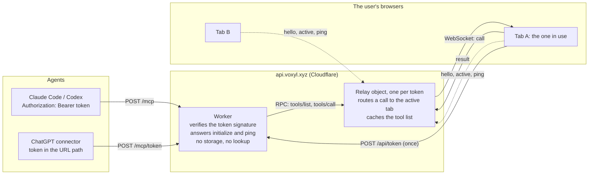

# Agent tools (`packages/tools`)

Design for the web version's MCP tool surface (started 2026-10-09). The Godot app's ~80 tools
grew one at a time; this is the same job seen whole. Status and next steps are at the end.

## Shape of the thing

- **`packages/tools`** is pure TypeScript (no DOM, no Node), like `core`. It holds a registry of
  tools: `{ name, title, description, input (Zod), annotations, handler(host, args) }`.
- **`ToolHost`** is what handlers call: the core `Project` plus the few things outside it
  (block libraries, clipboard, prefab and shared-palette stores). Handlers never see the
  worker, the relay or WebMCP, so they test in Node with an in-memory host.
- **Adapters** (separate, thin): (1) the world worker, via one `{type: "tool", name, args}`
  message that calls `registry.call(host, name, args)`; (2) WebMCP in the tab; (3) MCP over HTTP
  through the relay; (4) the headless host. Each turns the registry into its transport's
  tool list (Zod to JSON Schema) and routes calls.
- Tools take **names, never ids**. Core wants numeric semantic and palette ids, so the tool
  layer resolves names and fails with a clear error listing the near matches.

## Principles (what we change from Godot)

1. **One addressing language.** Every tool that targets cells takes core's `Region` (box,
   selection, semantic, palette, structure, all, any, not, grow, shrink), with names for
   semantics and palettes. In Godot `{semantic}` meant a bounding box and surprised agents; in
   core it means the cells holding it.
2. **Selection is a region, not a mode.** `select` sets the user's selection from any region
   expression (that replaces `selection_set/resize/filter/grow/shrink/combine/isolate` and
   `structure_find`). Other tools reach it with `{selection: true}`. Agents rarely need it:
   they pass the region straight to the tool.
3. **Shaped or whole is the palette's business.** The agent places a semantic; the palette
   entry says whether that is a block or a part. No `cells_set` vs `parts_add` split, no
   `not_shaped` and `shape_mismatch` errors. Slot and orientation arguments apply when the
   semantic's shape needs them.
4. **One orientation vocabulary** per cell: `facing` (a direction word, the side it looks or
   points toward), `up` (direction word), and for parts `slot`. Torch-like blocks take
   `attached_to` as `facing`'s opposite with a documented rule. Direction words:
   up down north south east west. North is -Z.
5. **One undo step per call**, labelled `Claude: <tool>` (`source: "Claude"`, `group` = the
   call). A multi-command tool still undoes as one.
6. **Safe to repeat.** Mutating tools take an optional `op_id`; it becomes the command id, so
   core answers `duplicate` and nothing changes (ChatGPT runs calls twice).
7. **Preview is free.** Every mutating tool takes `dry_run`: it runs on `project.preview` and
   returns the same report without touching the project.
8. **Cheap by default.** Results are small: counts, bounds, a capped `rejected` list (with a
   `rejected_count`), never the cells. Reads are explicit about size.
9. **Structured everything.** Errors are `{ok: false, error: {code, message, ...}}`; partial
   problems use one `problems` list (Godot mixed `problems` and `warnings`). Success is
   `{ok: true, ...}`. Annotations carry `readOnlyHint`, `destructiveHint`, `idempotentHint`.
10. **Intent over cells.** Prefer verbs a builder would say (fill, replace, build from layers,
    move) to lists of coordinates. Coordinates are `[x, y, z]` integers.

## Tool set

Godot tool names in brackets show what each replaces.

**Session**
- `status`: the first call. Project name, bounds, cell count, palettes and semantics
  (names only), the user's selection (bounds and count), history labels (next undo and
  redo), whether an editor tab is attached, and a short conventions reminder.
  [status, project_info, view_list, selection_get]
- `history`: `{action: list | undo | redo, count}`. [history]

**Read**
- `inspect`: `{where?, view: summary | layers | cells | materials}`. `summary` is bounds,
  counts by semantic, parts by shape; `materials` groups by the actual block with its
  library and Minecraft id; `layers` is the text-layer dump (capped); `cells` lists up to
  N cells with their full state. [region_stats, region_text, cell_get, selection_get]
- `find_blocks`: `{query?, library?, near_color?, tolerance?, limit, offset}` plus
  `libraries: true` to list libraries. [block_search, library_list, block_get]
- `describe_shapes`: `{shape?}` lists shapes, or describes one (family, slots) and, with
  `up` and `facing`, which slot matches. [shape_list, shape_describe, shape_orient]

**Edit**
- `place`: `{cells: [{at, semantic, facing?, up?, slot?}], ...}`, or `{at: [[x,y,z],...],
  semantic}` for many cells with one semantic. [cells_set, parts_add]
- `fill`: `{where, semantic, style: solid | hollow | walls | frame | floor, ...}`. [region_fill]
- `clear`: `{where, semantic?}` (only that semantic when given). [cells_clear]
- `replace`: `{where?, from, to}`: every cell of one semantic becomes another, keeping
  orientation. [region_replace, semantic swaps]
- `build`: `{origin, axis, legend, layers}` text layers, with `where` for a dump the other
  way via `inspect`. [cells_place_layers]
- `transform`: `{where, move?, copy?, rotate?, mirror?, at?}`; a copy can be pasted
  elsewhere (`at`). One tool for move, copy, rotate and mirror. [region_move, region_copy,
  clipboard_paste, region_transform]
- `select`: `{where | null, isolate?}` sets or clears the user's selection.
- Every edit tool also takes `dry_run`, `op_id`, and optional `symmetry` and `repeat`
  (ported from Godot's edit props, added after the first tools land).

**Palette**
- `palette_get`: `{name?}`: the palette stack, or one palette's entries with the block each
  resolves to. [palette_list, palette_get]
- `palette_edit`: `{palette, ops: [{add|set|remove|rename, semantic, block?, shape?, glow?}],
  create?, link?}`: one call edits entries, and a rename carries the placed cells (core's
  rename does). [palette_create/update/delete, semantic_rename, project_palettes_set]

**Later** (each its own step)
- `prefab` tools (`prefab_list`, `prefab_save`, `prefab_place`, `prefab_edit`).
- `project` tools (list, open, create, settings).
- `capture` and `capture_sheet` (tiers 0 to 3; needs the CPU rasterizer, plan Phase 4).
- `export_schematic`, `probe_schematic`; Minecraft identity and NEI tools stay with import.
- User-view tools (`view_set`, `tool_set`, `cutaway`, `hotbar_set`) are UI state, not data:
  they stay out of the data registry and arrive as a separate `ui` group on the tab adapters
  only.
- Not carried over: `restart`, `logs` (dev-only), `screenshot` of the user's window.

## Build order

1. Package, registry, envelope, `ToolHost`, an in-memory test host, `status`, `history`,
   `inspect`, `select`, `place`, `fill`, `clear`, `replace`. Tests in Node. **Commit.**
2. `build`, `transform`, `palette_get`, `palette_edit`, `find_blocks`, `describe_shapes`.
3. Worker adapter: the `tool` message, the host over the worker's state. Then the WebMCP
   adapter in the tab and a dev panel to try a call.
4. Relay (Phase 4 server) and everything after.

## Status

**Steps 1 to 3 built (2026-10-09); 73 tool tests; the step 2 and step 3 notes are at the end.** Step 1:
`packages/tools` (`@voxyl/tools`: pure TS, depends on core, shapes and blocks, no session) with
the registry, envelope, `ToolHost`, an in-memory host (`MemoryHost`, exported for the headless
host and scripts) and eight tools: `status`, `history`, `inspect`, `select`, `place`, `fill`,
`clear`, `replace` (step 2 adds `palette_get`, `palette_edit`, `build`, `transform`,
`describe_shapes`, `find_blocks`). Tests run in Node (`packages/tools/test`); `pnpm check` is
green. Core needed no change.

What exists:
- **Registry.** `defineTool`, `TOOLS`, `listTools()` (name, title, description, JSON Schema from
  `z.toJSONSchema`, annotations; the recursive region schema converts fine) and
  `callTool(host, name, rawArgs)`, which never throws. Envelope `{ok: true, ...}` or
  `{ok: false, error: {code, message, ...}}`. Codes so far: `unknown_tool` (with
  `suggestions`), `bad_argument` (with `issues: [{path, message}]`, the likeliest union branch
  shown), `no_project`, `not_found` (with `kind`, `query`, `suggestions`), `ambiguous`
  (a name in several palettes; give `{name, palette}`), `too_large` (inspect layers),
  `bad_region`, `command_failed` (a core CommandError), `internal`.
- **ToolHost** = `{project, editorAttached?, newId?(), changed?(project, info)}`. `changed` is
  awaited after every real (not dry) change, the hook for persisting or telling views. Libraries,
  clipboard and the prefab and palette stores join as optional async members when the tools
  that need them land.
- **Call context.** A handler is `handler(host, args, call)`; `call.run(specs)` stamps command
  ids (`op_id`, or `op_id:1`, `op_id:2` for several), source `Claude`, label `Claude: <tool>`
  and one group (`claude:<op_id>`), so a multi-command call is one undo step. Dry runs apply the
  commands to `project.fork()` (what `preview` does, but for a sequence); several commands are
  proven on a fork first, so a call applies completely or not at all. A repeated `op_id` comes
  back `duplicate: true` with nothing changed.
- **Names.** `SemRef` is `"Name"` or `{name, palette}`; matching is exact, then
  case-insensitive when unambiguous. `ToolRegion` mirrors core's `Region` with names for
  semantics and palettes. Reading never creates anything: a name a palette could derive but
  has not yet matches no cells.
- **Results** are small: `changed` (cells), `bounds` as `[x0,y0,z0,x1,y1,z1]`, per-semantic
  `before/after`, `rejected` (first 20) with `rejected_count`, one `problems` list.
- **Tools.** `place` builds one `set` and merges parts into the cell's existing parts, checking
  `rejectPart` from shapes (reasons: `slot_taken`, `exclusive`, `micro_conflict`, ..., plus the
  tool's `block_in_cell`, `slot_required`, `bad_slot`, `out_of_world`). `fill` styles solid,
  hollow (clears the inside first unless `keep_inside`: two commands, one undo), walls, frame
  and floor, all from the region's bounding box intersected with the region. `clear` with
  `semantic` is one `set` that removes only that semantic's parts from a cell of parts.
  `replace` is `resemantic` (keeps orientation; `skipped` counts cells whose geometry does not
  fit, `force` relabels). `history` lists steps (a group is one step) and undoes or redoes
  `count` of them. `inspect` has summary, materials, layers (capped at 32,768 cells in bounds)
  and cells (paged).

Deviations from the design above:
- **Handlers take a third argument**, the call context (`handler(host, args, call)`), which
  carries `run`; the design had `run` on the host. Per call it can hold the op id, group and
  dry-run flag, and hosts stay simple.
- **`select` has no `isolate`**: isolating is view state (hiding everything else), so it
  belongs with the later `ui` tools, not the data registry.
- **`select` and `history` take `op_id`/`dry_run`** like the others. `select` is not an undo
  step (core's `select` is non-undoable). Repeating a `history` undo with the same `op_id` is a
  no-op only while there is something left to undo (otherwise it reports "nothing more").
- Shaped parts: micro shapes and architecture (roof) shapes work through a semantic's shape
  and a `slot` name; that was cheap and needed nothing from core.

Known gaps:
- (Closed in step 2: semantics are made with `palette_edit`; `up`/`facing` and `attached_to`
  work.)
- `symmetry` and `repeat` on edit tools are not in.
- `fill` styles other than solid use the region's bounding box; hollow's shell is "cells with a
  missing face neighbour". A part fill replaces the cell, it does not merge like `place`.
- A `{semantic}` region matching both a palette's own and a derived same-named semantic is
  `ambiguous`, never "all of them".
- `status` lists at most 200 semantics, and `regionStats` is a full scan (fine until builds are
  huge).

Next: step 4, the relay (Phase 4 server) so agents outside the tab (Claude Code, ChatGPT) reach the
same tools; see "Step 3 built" for what it can reuse.

### Step 2a built: `palette_edit`, `palette_get`

- `palette_edit {palette, create?, palette_set?, ops[], delete?}`: ops are `add | set | rename |
  remove` on a semantic by name, with `block`, `shape`, `glow`, `tint`, `description` (null
  clears a field; `set` merges into the semantic's own look, so setting an inherited semantic
  overrides it in that palette only, deriving it on first use). A rename keeps the id, so
  cells follow. The call plans on a scratch fork (new palette ids come from the commands),
  then runs the same commands as one group: one undo step, all or nothing, errors say
  `ops[i] <op> <name>`. `delete: true` removes the palette (core refuses while cells use it).
- `palette_get {palette?}`: palette list, or one palette's entries with the resolved block,
  shape, glow, tint, cell count, `inherited_from` and `derived_from`.
- `callTool` now answers a repeated `op_id` before running the handler (`duplicate: true`), by
  looking for the id in the project history; planning tools can't be re-run on a changed project.
- Gap: `link` (shared palettes) needs the shared-palette store on the host; it lands with it.

### Step 2b/2c built: orientation, `build`, `transform`, `describe_shapes`

- **Orientation (closes two step-1 gaps).** `up` and `facing` now pick the slot of a roof or
  slope shape: `up` = where the shape's top points, `facing` = where its low (downhill) end
  looks (its model -Z; verified on the roof tile, which falls toward -Z). `archSlotFor` in
  `cell.ts` searches the 24 `(side, turn)` slots with `archRotation`; an explicit `slot` still
  wins. `attached_to` (torch-like blocks) sets `up` to the opposite side, so `down` = standing
  on the block below and `north` = leaning out of the north wall; the semantic's placement
  profile fixes the rotation (core's `attachedTo` reads it back). It is rejected together with
  `facing`/`up`, and ignored (noted) on parts. `palette_edit` gained `placement` (a standard
  profile name: torch, stairs, slab, log, horizontal, facing, hopper, cube) so a semantic can
  be made attachable; `palette_get` reports it. The block library's `attachment: "torch"` flag
  is not read yet (that needs the host's block profiles, wired with the editor).
- **`build {origin, axis?, legend, layers}`** is core's `parseRegionText` into one `set`; legend
  names are checked first so a typo gets near matches, and text problems come back as a
  `problems` list under `bad_argument`.
- **`transform {where, by|to, copy?, turn?, mirror?, air?}`**: with `by` (offset) or `to`
  (lowest corner) it is core's `move` or `copy`; without them `turn`/`mirror` run core's
  `transform` in place. Rotating each cell in place (`rotate`) and pasting a prefab or the
  clipboard (`paste`) are not exposed: paste waits for the prefab and clipboard host members.
- **`describe_shapes {shape?, up?, facing?}`** lists shapes, or gives one's slot names, and the
  slot a given `up`/`facing` means. It needs no project.

### Step 2d built: `find_blocks`

- `ToolHost.libraries?()` (sync or async) returns the block libraries (`@voxyl/blocks`
  `Libraries`); `MemoryHost` takes them in its constructor or `MemoryHost.create({libraries})`.
  `@voxyl/tools` now depends on `@voxyl/blocks`.
- `find_blocks {query?, library?, near_color?, tolerance?, limit, offset, libraries?}` wraps
  `searchBlocks` (no icons in results); `near_color` ranks the first 5,000 matches of the query
  by RGB distance. `libraries: true` lists libraries. A host without `libraries` answers
  `unavailable`; an empty one answers with a problem. `palette_edit` warns (in `problems`)
  about a `block` the libraries lack, and sets it anyway.

### Still open after step 2

- `palette_edit` `link` (shared palettes) and anything touching the shared-palette store.
- `paste` of a prefab or the clipboard, and in-place `rotate` of cells (core has both).
- Reading the block library's `attachment` flag (host block profiles) for `attached_to`.
- `symmetry` and `repeat` on edit tools; the `prefab`, `project` and `capture` tools.

### Step 3 built: tools callable inside the running editor

- **Worker adapter** (`apps/web/src/world/world-worker.ts`, `protocol.ts`). Two commands:
  `{type: "tool", name, args}` replies the `callTool` envelope (round-tripped through JSON, so it is
  plain data) and `{type: "tools"}` replies `listTools()`. They are ordinary commands, so they run
  through the worker's one queue, serial with the editor's own, and `run` then does the usual
  history, selection and pump bookkeeping. `toolHost` is a `ToolHost` over the module state:
  `project` is the open one (null gives `no_project`; `status` still answers), `editorAttached:
  true`, `libraries()` waits for the stored libraries, and `changed()` bumps `contentRev` and
  schedules the autosave (as `applyEdit` does; it has no report to tell cells from palette-only
  changes, so it always bumps, which only costs a selection refresh). Dry runs never call it.
- **WebMCP** (`apps/web/src/agent/webmcp.ts`, one file, unit-tested against a fake model
  context). `registerWebMcp(client)` finds `document.modelContext`, then `navigator.modelContext`;
  does nothing when neither exists (today that is every browser without Chrome's flag or origin
  trial); registers each tool (name, description, JSON Schema, annotations) with an
  `execute` that forwards to the worker and answers `{content: [{type: "text", text: <envelope
  JSON>}], isError: !ok}`; ignores a throwing duplicate registration; disposing aborts the
  `{signal}` it passed and calls any returned handle's `unregister()` and `unregisterTool(name)`.
  `App.tsx` calls it once per engine (so once at startup; React's dev double mount unregisters
  the first), with no project required: tools answer `no_project`.
- **Dev panel.** The Dev panel (Hud) has a Tools section: tool select, JSON arguments, Run, result.
  `window.voxylTools = {list(), call(name, args)}` is the same client, for the console, Playwright
  and `pnpm shot`.
- **Trying it.** With `pnpm dev` running: `pnpm shot "world=city-1m" --eval script.js` runs the file
  as an async function body in the page once the world has meshed and prints its return value
  (e.g. `return await window.voxylTools.call("status", {})`); the screenshot follows.
- **Verified** against the dev server: `palette_edit` (new semantic), `fill`, `place`, `inspect`
  (49 cells counted), `history` (steps labelled `Claude: palette_edit/fill/place`), the mesh count
  rising 73 to 74 for the new chunk, the editor's own `undo`/`redo` command reverting and
  restoring a tool step (the first undo took the last `Claude: place`), a dry run changing
  nothing, `unknown_tool` suggestions, `status` with no project (`project: null`), and a saved
  project's autosave picking up tool edits (125 cells written 1.5 s later). No console errors.
- **Not verified**: a real WebMCP host (no browser here has the API; only the fake context test),
  the Undo button in the top bar clicked by hand (the same `undo` command was sent instead), and
  tools other than the five above through the live worker (they share the same path and have
  Node tests).
- **Gaps**: tool edits do not set the editor's toast or "last edit" timing; `changed()` always bumps
  `contentRev`; no per-call cancel (a long tool holds the worker queue); the UI-state tools
  (`view_set`, `cutaway`, ...) are still missing; `libraries()` returns the live map, so a tool must
  not mutate it.
- **Next, at the time:** the relay. What landed after this note is below.

### After step 3

Symmetry and repeat, copy and paste, prefab tools and project tools landed with the step 3
adapters (see the commits of 2026-10-09). Then, same day:

- **`guide`** is the conventions document (axes, regions, shapes, symmetry, the tool map).
  `status` still carries the one-line reminder and points here.
- **`export_schematic`** writes a Schematica file from the build, a region or a prefab. The
  report names what was left out; the bytes download in the editor (`download` effect).
  `probe_schematic` reads a file back from base64. Identity comes from `ToolHost.identify`
  (the worker's libraries, then the built-in vanilla names).
- **`capture` and `capture_sheet`** pick a camera and ask the tab to render it with the
  existing WebGPU renderer, off the user's camera (`capture` effect; the picture is added to
  the result). Sheets: review, elevations, turntable, compare. They show what is already
  meshed. There is still no CPU rasterizer, so a headless host cannot take the picture.
- **View tools** (`view_list`, `view_set`, `cutaway`, `hotbar_set`, `tool_set`) are editor
  state. They are not in the data registry. The tab's client lists them beside the worker
  tools and runs them itself.
- **Headless host, first cut** (`pnpm host`, `apps/server`): MCP Streamable HTTP on
  `127.0.0.1:47825/mcp`. Tools run in this process on one in-memory project (`MemoryHost`).
  No tab, no persistence past the process, no SSE. `capture` and `export_schematic` answer
  `unavailable`. Claude Code:
  `claude mcp add --scope user --transport http voxyl-headless http://127.0.0.1:47825/mcp`.
  It shares the MCP layer with the relay (`handleMcpBody` in `@voxyl/relay`). The production
  plan is tab-required (below); this stays as a dev and test host.
- The first **local bridge** (`pnpm bridge`, a Node forwarder on :47824) was replaced by the
  relay the same day: dev now runs the real Worker locally (`pnpm relay`), so dev and
  production share one code path.

## The relay (built 2026-10-09)

How an agent outside the page reaches the editor. `packages/relay` is the pure half (MCP over
HTTP as a function of a backend, the routing core, the tab protocol, tokens; tested in Node,
no DOM or Node types). `apps/relay` is the Cloudflare half: a Worker plus one Durable Object
per agent token. The tools still run only in the user's tab.



**Scenarios**

1. *Tab open, agent calls a tool.* Agent POST, Worker verifies the token (HMAC, no lookup),
   asks the object by RPC; the object sends `{call, id, name, args}` down the WebSocket of the
   tab used last; the tab runs it on the live world through the same path as a click (one
   undo step labelled `Claude: <tool>`, drawn at once) and answers `{result, id}`; the object
   resolves the agent's HTTP request. Server cost: one Worker request, one object request,
   two WebSocket messages.
2. *Several tabs.* Every tab connects with a random `tabId`. A tab says `active` when it
   becomes visible or focused; the call goes to the tab with the newest stamp (kept in the
   socket's attachment, so it survives hibernation). Close that tab and the next newest takes
   over. A tab that reconnects replaces its own old socket. At most 8 tabs per token.
3. *No tab open.* `initialize`, `ping` and `tools/list` still answer (the list was cached in
   the object's storage by the last `hello`), so the agent keeps its tools. `tools/call`
   returns an error *result* (`no_editor`), not a protocol error, telling the model and user
   to open voxyl.xyz, Home, Agents. v1 has no headless execution (a call never edits a
   project nobody has open); that needs Workers Paid CPU limits and a project store.
4. *Tab closes or sleeps mid-call.* A closed socket fails what it owed at once
   (`tab_closed`: "may or may not have run, check status"); a frozen tab hits the 90 s
   `editor_timeout`. Mutating tools take `op_id`, so a repeat is a no-op.
5. *Idle.* The tab pings every 30 s; the edge answers `pong` without waking the object
   (`setWebSocketAutoResponse`), so an idle relay is evicted from memory and bills no duration.
   No pong for 75 s and the tab reconnects (1 s doubling to 30 s; `online` resets it).
   A woken object finds its sockets with `ctx.getWebSockets()` and rebuilds from attachments.
6. *Agent access is off* (the default). The tab never opens a socket and mints no token.

**Tokens.** `vx1.<id>.<signature>`: `id` is 16 random bytes, `signature` an HMAC-SHA-256 of the
id under the Worker's `TOKEN_SECRET`. `POST /api/token` mints one (stateless; no database). A
made-up token is refused in the Worker before any object is woken. The id is the relay's name,
so it is also the `userId` the plan wants from day one: signing in later attaches an identity
to it. The browser keeps the token in `localStorage` (`voxyl.agent`); Home, Agents shows the
one sub-tab per agent (Claude Code, Codex, ChatGPT), each a numbered walkthrough with copy
blocks and notes (`agentRecipes`). Claude Code gets the command, Codex the `config.toml` table,
and ChatGPT's website chat a URL (`/mcp/<token>`, for connectors with no header field: the URL
is the password; chatgpt.com/plugins, + , Create custom MCP server, Authentication None; needs
a plan with custom connectors, and the editor tab open). Not yet tried against the deployed
relay from a real ChatGPT chat. "New token"
rotates it, which cuts off agents set up with the old one. Rotating `TOKEN_SECRET` cuts off
everyone. The tab's socket sends the token in the WebSocket subprotocol
(`voxyl.v1`, then the token), since browsers cannot set headers.

**Limits and costs (free plan).** The Worker only parses a body and forwards: well inside
10 ms CPU. Per token: 16 calls in flight, 8 tabs, 1 MB request bodies, 90 s per call. The
tool list is about 100 KB (37 tools), stored once per change (one row write), not per
connect. No rate limiting yet beyond these caps: add a Cloudflare rate-limit rule on
`/api/token` and `/mcp` before wide use.

**Security.** The token is the only credential, and holding it is full control of the open
editor, so Agents says so. Nothing is stored server-side except the tool list. `/tab` and
`/api/token` accept only voxyl.xyz, `*.voxyl.pages.dev` and localhost origins (a request with
no Origin, such as curl, is allowed: the token is the gate). `/mcp` has open CORS (it is not
cookie-authenticated). Results from a tab are only accepted from the tab that was asked.

**Deploy (one time).** The relay is a separate Worker from the Pages app. From `web/apps/relay`:

```
pnpm exec wrangler login
pnpm exec wrangler deploy                      # also creates api.voxyl.xyz (custom domain)
node -e "console.log(require('crypto').randomBytes(32).toString('base64url'))" | pnpm exec wrangler secret put TOKEN_SECRET
node ../../tools/relay-smoke.ts --url https://api.voxyl.xyz --idle 25
```

Then deploy the app (the manual **Deploy** workflow, or `wrangler pages deploy`): the
production build talks to `https://api.voxyl.xyz` (override with `VITE_RELAY_URL`; the dev
server uses `http://127.0.0.1:47826`, which is `pnpm relay`). The **Deploy** workflow (`.github/workflows/deploy.yml`)
does both from Actions, relay first (the relay job is main only) with the secrets `CLOUDFLARE_WORKERS_API_TOKEN`,
`CLOUDFLARE_ACCOUNT_ID` and `RELAY_TOKEN_SECRET`. `pnpm install` needed `allowBuilds` for
`esbuild` and `workerd` in `pnpm-workspace.yaml` (wrangler's dependencies run install scripts).

**Proven.** Local (workerd via `wrangler dev`): `tools/relay-smoke.ts` with a fake tab (mint,
401 on a bad token, initialize, no-tab error, tool list, call round trip, ping/pong, token in
the path, after-close behaviour; also with a 25 s idle first) and `tools/relay-e2e.ts` with a
real headless Edge tab and the real UI: Home, Agents, turn on, the token minted and kept, 37
tools listed, `project_create`, `palette_edit` and `fill` through the relay, the page's own
view showing the 64 cells, a `capture` picture rendered by the tab's WebGPU renderer and
returned, a reload that reconnects by itself, and the "open the editor" error and cached tool
list after the tab closes. 23 relay unit tests (routing, ordering, timeouts, forged results,
limits, tool-list cache, MCP batch and notification handling, token forgery). The Worker
bundles to 20 KiB. **Not yet proven:** the deployed Worker on Cloudflare's edge (hibernation
in particular: local workerd may not evict), a real Claude Code, Codex and ChatGPT
connection, a capture while the tab is hidden, and a very large result over the WebSocket.

**Next.** Deploy and run the smoke and e2e scripts against production, then a real Claude Code
session; rate limits; a persisted project store so a headless host can answer with no tab;
OAuth for ChatGPT's connector (the URL-token form is the stopgap); show the connected agent's
last call in the Agents tab.
